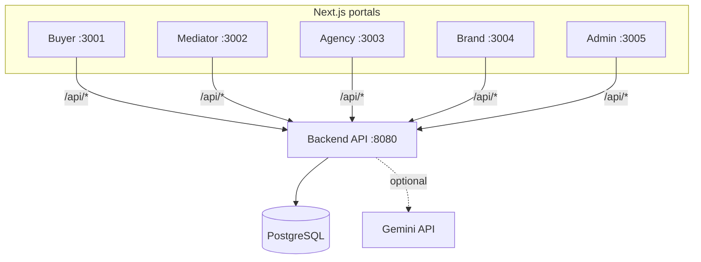
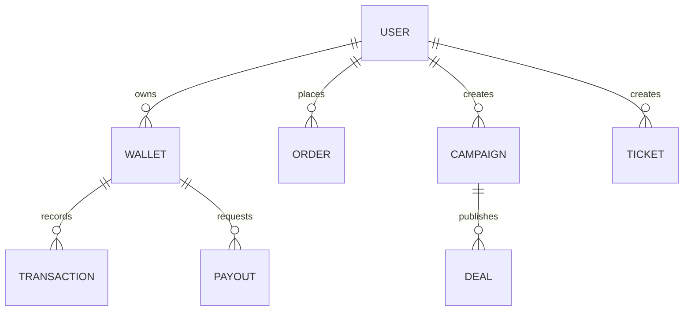

# BUZZMA Ecosystem

[](../../actions/workflows/ci.yml)

Multi-portal commerce + operations platform — monorepo with 5 Next.js portals, Express API, and automated E2E testing.

## Tech Stack

| Layer | Technology |
| --- | --- |
| Backend | Express 5 · TypeScript · PostgreSQL · Prisma ORM |
| Frontend | Next.js 15 · React 19 · Tailwind CSS |
| Auth | JWT (access + refresh tokens) · RBAC |
| AI | Google Gemini (proof verification, OCR via Tesseract) |
| Testing | Vitest (unit) · Playwright (E2E) |
| CI/CD | GitHub Actions · Render (backend) · Vercel (portals) |
| Realtime | Server-Sent Events (SSE) |

## System diagram

All portals follow one contract:

- The UI calls `/api/*`
- Each Next app rewrites `/api/*` → `${NEXT_PUBLIC_API_PROXY_TARGET}/api/*`



## Data model (conceptual)



## Repo layout

```text
├── backend/         Express API, Prisma schema, services, seeds, tests
├── apps/
│   ├── buyer-app/   Buyer portal (dev port 3001)
│   ├── mediator-app/Mediator portal (dev port 3002)
│   ├── agency-web/  Agency portal (dev port 3003)
│   ├── brand-web/   Brand portal (dev port 3004)
│   └── admin-web/   Admin portal (dev port 3005)
├── shared/          Shared components, hooks, utils, types
├── e2e/             Playwright end-to-end tests
│   ├── helpers/     Shared auth & seed account utilities
│   ├── fixtures/    Test images and mock data
│   ├── admin/       Admin portal tests
│   ├── agency/      Agency portal tests
│   ├── brand/       Brand portal tests
│   ├── buyer/       Buyer app tests
│   ├── mediator/    Mediator app tests
│   └── lifecycle/   Full order lifecycle API tests
├── scripts/         Dev tooling (stack launcher, cleanup, health checks)
└── docs/
    ├── operations/  Deployment and production checklists
    └── audits/      Security and codebase audits
```

## Docs

### Architecture & Design

| Document | Description |
| --- | --- |
| `docs/ARCHITECTURE.md` | System diagram, auth model, ER diagram |
| `docs/API.md` | Complete API surface — 121 endpoints |
| `docs/BACKEND_API_SURFACE.md` | Detailed endpoint behavior notes |
| `docs/DOMAIN_MODEL.md` | 21 Prisma models, 23 enums, relationships |
| `docs/RBAC_MATRIX.md` | Role-based access matrix |
| `docs/MONEY_FLOW.md` | Wallet, transaction, payout flows |
| `docs/REALTIME.md` | SSE contract and event types |
| `docs/SYSTEM_FLOW.md` | End-to-end system workflows |

### Operations & Deployment

| Document | Description |
| --- | --- |
| `docs/operations/DEPLOYMENT.md` | Quick deployment guide |
| `docs/operations/PRODUCTION_READINESS_CHECKLIST.md` | Pre-launch checklist |

### Audits

| Document | Description |
| --- | --- |
| `docs/audits/CLEANUP.md` | Safe deletion rules |

## Prerequisites

- Node.js 20+
- npm 9+

## Quickstart (local)

1. Install

```bash
npm install
```

1. Configure backend env

- Copy `backend/.env.example` → `backend/.env`
- Set `DATABASE_URL` to your PostgreSQL connection string.

1. Start everything

```bash
npm run dev:all
```

Ports:

- API: `http://localhost:8080`
- Buyer: `http://localhost:3001`
- Mediator: `http://localhost:3002`
- Agency: `http://localhost:3003`
- Brand: `http://localhost:3004`
- Admin: `http://localhost:3005`

## Reset DB (admin only)

This truncates all tables and seeds only a single admin user.

1. Set admin seed values in `backend/.env` (recommended) or as environment variables:

- `ADMIN_SEED_USERNAME` (admin login uses username/password)
- `ADMIN_SEED_PASSWORD`
- `ADMIN_SEED_MOBILE` (required by the User model; not used for admin login)
- `ADMIN_SEED_NAME`

1. Confirm the wipe (required safeguards):

- `WIPE_DB=true`
- `WIPE_DB_CONFIRM=WIPE`

1. Run:

```bash
npm run db:reset-admin
```

Windows PowerShell one-liner example:

```powershell
$env:ADMIN_SEED_USERNAME='******'; $env:ADMIN_SEED_PASSWORD='*********'; $env:ADMIN_SEED_MOBILE='9000000000'; $env:ADMIN_SEED_NAME='Chetan Admin'; $env:WIPE_DB='true'; $env:WIPE_DB_CONFIRM='WIPE'; npm run db:reset-admin
```

## Environment variables

Backend (`backend/.env`):

- `NODE_ENV`, `PORT`
- `DATABASE_URL` (PostgreSQL connection string)
- `JWT_ACCESS_SECRET`, `JWT_REFRESH_SECRET` (in production: real secrets, >= 20 chars)
- `CORS_ORIGINS`
- `GEMINI_API_KEY` (optional)

Portals:

- `NEXT_PUBLIC_API_PROXY_TARGET` (defaults to `http://localhost:8080`)

Examples:

- Root: `.env.example`
- Per-app: `apps/*/.env.local.example`

## Testing

### Backend tests (Vitest)

```bash
npm run test:backend
```

Backend tests are organized into:

- **Unit tests** (`backend/tests/unit/`): Pure function tests for money, pagination, mediatorCode, signedProofUrl, authCache, idWhere, env config, AppError.
- **Integration tests** (`backend/tests/`): API tests against a real database — health, auth, RBAC, orders, tickets, notifications, wallet, push notifications, security middleware, audit logs.

### E2E tests (Playwright)

```bash
npx playwright test -c playwright.api.config.ts   # API-only (no portals needed)
npx playwright test                                 # Full stack (all portals)
```

E2E tests are organized by role:

- `e2e/admin/` — Admin security API, users management, portal smoke
- `e2e/agency/` — Agency security API, inventory, portal smoke
- `e2e/brand/` — Brand security API, orders/campaigns, portal smoke
- `e2e/buyer/` — Buyer security API, order creation, portal smoke
- `e2e/mediator/` — Mediator security API, verification flow, portal smoke
- `e2e/lifecycle/` — Full order lifecycle: create → verify → settle → wallet

### Run everything

```bash
npm test
```

Notes:

- Playwright E2E tests are organized by role: `e2e/{admin,agency,brand,buyer,mediator,lifecycle}/`.
- Playwright starts a safe E2E backend + all portals automatically.
- E2E uses deterministic seeding via Prisma (PG-only).

## Cleanup

To remove generated artifacts (build outputs, caches, Playwright traces):

```bash
npm run clean
```

Details and safe deletion criteria: `docs/audits/CLEANUP.md`.

## Deployment

- Backend: Any Node.js host (e.g., Railway, Fly.io, a VPS)
- Portals: Vercel (or any Next.js host)

Start here:

- `docs/operations/DEPLOYMENT.md`
- `docs/operations/DEPLOYMENT_RENDER_VERCEL_NO_DOMAIN.md`

## Troubleshooting

- CORS: ensure `CORS_ORIGINS` includes your portal origins.
- Wrong backend URL: set `NEXT_PUBLIC_API_PROXY_TARGET`.

## Health & diagnostics

Backend endpoints:

- `GET /api/health` returns API + database readiness.
- `GET /api/health/e2e` is stricter and used by Playwright to confirm the stack is fully ready.

Every response includes an `x-request-id` header. Include that value when reporting issues to correlate logs.

## Repo hygiene

See `PUSH_CHECKLIST.md` for a pre-push checklist.
