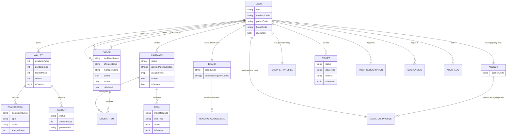

# Architecture

This repo is an npm-workspaces monorepo with:

- 5 Next.js portals under `apps/*`
- An Express + TypeScript + PostgreSQL (Prisma) backend under `backend/`
- A shared package under `shared/`

## High-level system

```mermaid
graph TD
  subgraph Portals[Next.js portals]
    B[Buyer (3001)]
    M[Mediator (3002)]
    A[Agency (3003)]
    BR[Brand (3004)]
    AD[Admin (3005)]
  end

  API[Backend API (Express, 8080)]
  DB[(PostgreSQL)]
  AI[Gemini API]

  B -->|/api/* via Next rewrites| API
  M -->|/api/* via Next rewrites| API
  A -->|/api/* via Next rewrites| API
  BR -->|/api/* via Next rewrites| API
  AD -->|/api/* via Next rewrites| API

  API --> DB
  API -. optional .-> AI
```

## Auth + roles

- JWT bearer auth for most routes.
- Roles are stored in PostgreSQL and validated on every request (zero-trust tokens).
- Upstream suspension enforcement:
  - Buyer access can be blocked if their mediator/agency is not active.
  - Mediator access can be blocked if their agency is not active.

Roles: `shopper`, `mediator`, `agency`, `brand`, `admin`, `ops`.

## Soft-delete rule

All tables implement soft delete:

- Active row means `is_deleted = false`.
- Uniqueness indexes are partial on `is_deleted = false`.

## Core data model (conceptual)

> 21 Prisma models. Full details: `docs/DOMAIN_MODEL.md`



## Money safety (wallet/ledger)

- Wallet updates are done via idempotent transactions (`Transaction.idempotencyKey` has a unique index for non-deleted rows).
- Brand→Agency payouts debit the brand wallet and credit the agency wallet with replay-safe idempotency keys.
- Cooling-period settlement uses an **atomic claim guard** (`updateMany` with WHERE on `affiliateStatus: 'Pending_Cooling'`) to prevent double-settlement from concurrent cron invocations.
- Settler interval and transaction timeout are configurable via `SETTLER_INTERVAL_MS` and `SETTLER_TX_TIMEOUT_MS` env vars.

## Order workflow

Orders have a strict state machine (`workflowStatus`), with anti-fraud constraints:

- A buyer cannot have more than one active order per deal.
- Some workflows can be frozen (e.g., suspensions) and require explicit reactivation.
- Re-proof submissions are capped at `DEFAULT_MAX_REPROOF_ATTEMPTS` (5) per order, tracked via `WORKFLOW_TRANSITION` events with `metadata.to === 'REJECTED'`.

## AI verification

- Google Gemini Vision API with **circuit breaker** (3-failure threshold, 5 min cooldown, HALF_OPEN requires 3 consecutive successes before closing).
- AI extraction uses **exponential backoff retry** (3 attempts, 200/400/800ms) for transient failures; validation errors are thrown immediately.
- **Overall timeout** (50 s) on all three verification functions (`verifyProofWithAi`, `verifyRatingScreenshotWithAi`, `verifyReturnWindowWithAi`) prevents the Gemini multi-model loop from exceeding the frontend 60 s request timeout.
- **Graceful degradation**: Infrastructure failures (OCR capacity, Gemini downtime, timeouts) in all proof submission paths (order creation, rating, return-window, re-upload) fall through to manual mediator review instead of returning 500. User-facing validation errors (422 `AppError`) are still thrown.
- Confidence thresholds: 80% for individual proofs, 70% for bulk — configurable via `AI_PROOF_CONFIDENCE_THRESHOLD`.
- Confidence values are sanitised with `Number.isFinite()` and clamped to 0–100 before comparison.
- Fallback to Tesseract OCR when Gemini circuit is open.

## Security hardening

- All proof-download endpoints enforce role-based authorization (brand owner, assigned agency, mediator, or buyer ownership).
- Proof upload accepts JPEG, PNG, and WebP only (GIF excluded).
- Token refresh uses retry with exponential backoff (3 attempts, 300/600/1200ms) before expiring the session.
- All deletion is soft-delete via `is_deleted` (Boolean); no hard deletes in application code.
- **Request scanning**: Security middleware blocks unambiguously malicious patterns (SQL injection, path traversal, null bytes, XSS) and logs suspicious-but-not-conclusive patterns for audit trail. Deep scanning is skipped for payloads >512 KB (typically image uploads) to prevent CPU abuse.
- **Lineage cache coherence**: The mediator↔agency lookup cache (`lineage.ts`, 60 s TTL) is explicitly invalidated on admin user status changes, user deletion, mediator approval, and mediator rejection — ensuring downstream authorization checks reflect the latest state immediately.
- **Cart isolation**: Frontend cart storage keys are scoped per authenticated user (`mobo_cart_v2_{userId}`). Unauthenticated sessions use a dedicated anonymous key (`mobo_cart_v2_anon`) to prevent cross-user cart leakage on shared devices.
- **Error boundary loop protection**: The global `ErrorBoundary` limits hard reloads to 3 consecutive attempts (tracked via `sessionStorage`) to prevent infinite reload loops.

## Error handling

- Every `FileReader` in the frontend has an `onerror` handler — either rejecting a wrapping Promise or showing a user-facing toast (15 instances audited).
- `shared/utils/imageHelpers.ts` provides `readFileAsDataUrl()` with a configurable timeout (default 30 s) and abort support.

## Accessibility

- All interactive elements meet a 44 × 44 px minimum touch target (WCAG 2.5.5 AAA).
- Confirmation dialogs focus the cancel button by default (safe action first for destructive dialogs).
- Notification items expose `role="status"` and `aria-label` for screen readers.
- Modal component implements a focus trap (Tab/Shift+Tab cycles within the dialog panel).
