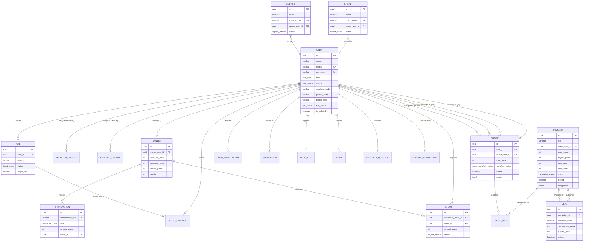

# MOBO (BUZZMA) — Complete Database Documentation

> **Production-level database documentation for the MOBO multi-stakeholder commerce platform.**
> Last updated: April 2026 | Schema version: PostgreSQL via Prisma ORM | 19 models, 22 enums.

---

## Table of Contents

1. [System Overview](#1-system-overview)
2. [Domain Modeling](#2-domain-modeling)
3. [Database Design](#3-database-design)
4. [Full Schema Breakdown](#4-full-schema-breakdown)
5. [Relationships](#5-relationships)
6. [ER Diagram](#6-er-diagram)
7. [Data Flow](#7-data-flow)
8. [API to Database Mapping](#8-api-to-database-mapping)
9. [Performance](#9-performance)
10. [Security](#10-security)
11. [Edge Cases & Failures](#11-edge-cases--failures)
12. [Scalability](#12-scalability)
13. [Sample Queries](#13-sample-queries)
14. [Migrations](#14-migrations)
15. [Audit & Logging](#15-audit--logging)
16. [Improvements](#16-improvements)
17. [Developer Guidelines](#17-developer-guidelines)
18. [Final Summary](#18-final-summary)

---

## 1. System Overview

### 1.1 What the System Does

MOBO (marketed as **BUZZMA**) is a multi-stakeholder commerce ecosystem that connects four primary participants in a structured deal-driven marketplace:

| Participant | Role |
|---|---|
| **Brands** | Supply products, fund campaigns, manage budgets |
| **Agencies** | Distribute campaigns regionally, manage mediator squads |
| **Mediators** | Connect buyers to deals via unique referral codes |
| **Buyers (Shoppers)** | Discover deals, purchase products, submit proof of purchase |

Additionally, **Admin** and **Ops** roles govern the entire platform (user management, financials, disputes, settlements).

**Core Value Proposition:** Brands list products as campaigns → Agencies set margins and distribute to mediators → Mediators share deals with buyers → Buyers purchase and submit proof → Settlement credits flow to buyer (commission) and mediator (margin) → Agencies receive payouts from brands.

### 1.2 Architecture

```
┌──────────────────────────────────────────────────────────────┐
│                     Client Layer (5 Next.js Portals)          │
│  ┌────────┐ ┌──────────┐ ┌────────┐ ┌───────┐ ┌───────┐    │
│  │ Buyer  │ │ Mediator │ │ Agency │ │ Brand │ │ Admin │    │
│  │  PWA   │ │   PWA    │ │  Web   │ │  Web  │ │  Web  │    │
│  │ :3001  │ │  :3002   │ │ :3003  │ │ :3004 │ │ :3005 │    │
│  └───┬────┘ └────┬─────┘ └───┬────┘ └───┬───┘ └───┬───┘    │
│      └───────────┴───────────┴───────────┴─────────┘         │
│                          │ HTTPS /api/*                       │
└──────────────────────────┼───────────────────────────────────┘
                           ▼
┌──────────────────────────────────────────────────────────────┐
│           Backend API (Express 5 + TypeScript, :8080)         │
│  ┌──────────┐ ┌──────────┐ ┌──────────┐ ┌──────────────┐    │
│  │   Auth   │ │  Orders  │ │  Wallet  │ │  AI Service  │    │
│  │ JWT+RBAC │ │ Workflow │ │  Ledger  │ │ Gemini OCR   │    │
│  └──────────┘ └──────────┘ └──────────┘ └──────────────┘    │
│  ┌──────────┐ ┌──────────┐ ┌──────────┐ ┌──────────────┐    │
│  │Campaigns │ │ Realtime │ │ Tickets  │ │  Push Notif  │    │
│  │  & Deals │ │   SSE    │ │ Support  │ │  Web Push    │    │
│  └──────────┘ └──────────┘ └──────────┘ └──────────────┘    │
│                          │                                    │
│       Prisma ORM  →  PostgreSQL (single database)            │
└──────────────────────────────────────────────────────────────┘
```

### 1.3 Tech Stack Reasoning

| Layer | Technology | Reasoning |
|---|---|---|
| **Database** | PostgreSQL | ACID compliance for financial transactions; strong indexing for 100k+ scale; JSONB for flexible event/metadata storage; mature ecosystem |
| **ORM** | Prisma (v6+) | Type-safe queries; auto-generated TypeScript client; migration management; introspection; relation mapping |
| **Backend** | Express 5 + TypeScript | Battle-tested HTTP framework; middleware composition; strong async/await support |
| **Frontend** | Next.js (5 portals) | SSR/SSG; file-based routing; API route rewrites to backend; PWA support for buyer/mediator apps |
| **Auth** | JWT (HS256) + bcrypt | Stateless auth with zero-trust DB verification on every request; bcrypt for password hashing |
| **Realtime** | Server-Sent Events (SSE) | Simpler than WebSocket for one-way server→client events; reconnect with backoff; audience-scoped delivery |
| **AI/OCR** | Google Gemini Vision API | Payment proof extraction (amount, date, UTR); review verification; 15-minute extraction cache |
| **Currency** | Integer paise (INR) | Avoids floating-point rounding errors; all amounts stored as `Int` in paise (1 INR = 100 paise) |
| **Monorepo** | npm workspaces | Shared code between frontends; single `package.json` root; consistent tooling |

---

## 2. Domain Modeling

### 2.1 Core Entities

| Entity | Real-World Mapping | Table | Purpose |
|---|---|---|---|
| **User** | Any person on the platform | `users` | Single row per user, regardless of role. Role determines portal access and hierarchy position. |
| **Brand** | A company/business selling products | `brands` | Brand entity with unique `brandCode`, connects to agencies |
| **Agency** | Regional distribution partner | `agencies` | Manages mediator squads, receives payouts from brands |
| **MediatorProfile** | A field agent / sales rep | `mediator_profiles` | Extension of User with unique `mediatorCode`, linked to parent agency |
| **ShopperProfile** | Consumer preferences | `shopper_profiles` | Extension of User with default mediator assignment |
| **Campaign** | A product offer with budget | `campaigns` | Brand-created, agency-distributed, has limited slots and funding |
| **Deal** | A mediator-scoped campaign snapshot | `deals` | Per-mediator copy of campaign with commission splits |
| **Order** | A buyer purchasing through a deal | `orders` | Full lifecycle tracking: placement → proof → verification → settlement |
| **OrderItem** | Line item in an order | `order_items` | Product details, price snapshot, campaign linkage |
| **Wallet** | Financial balance per user | `wallets` | Three sub-balances: available, pending, locked; optimistic concurrency via version |
| **Transaction** | Ledger entry for wallet mutation | `transactions` | Immutable, idempotent via `idempotencyKey`; 15 transaction types |
| **Payout** | Withdrawal request | `payouts` | Tracks beneficiary, amount, provider reference, status lifecycle |
| **Invite** | Registration access code | `invites` | Role-specific, usage-tracked, expirable |
| **Ticket** | Customer support case | `tickets` | Cascade-routed: buyer→mediator→agency→brand→admin |
| **TicketComment** | Thread-style reply on a ticket | `ticket_comments` | Back-and-forth communication between creator and handler |
| **PendingConnection** | Brand-agency connection request | `pending_connections` | Join table for brand↔agency approval workflow |
| **PushSubscription** | Web push endpoint | `push_subscriptions` | VAPID-based notifications for buyer and mediator PWAs |
| **Suspension** | Admin disciplinary action record | `suspensions` | Immutable audit trail: suspend/unsuspend with reason |
| **AuditLog** | System-wide audit entry | `audit_logs` | Append-only: actor, action, entity, IP, metadata |
| **SecurityQuestion** | Password recovery Q&A | `security_questions` | Bcrypt-hashed answers, 7 predefined questions |
| **SystemConfig** | Platform-level settings | `system_configs` | Key-value configuration (admin contact, etc.) |

### 2.2 Entity Hierarchy (Operational Chain)

```
Brand
  └── connects to → Agency (via connectedAgencyCodes[])
       └── parents → Mediator (via parentAgencyCode / parentCode)
            └── parents → Buyer/Shopper (via parentCode)
```

This hierarchy is fundamental to:
- **Scope visibility** — each role sees only data in their downline
- **Cascade suspension** — suspending an agency freezes all mediators and buyers below
- **Commission flow** — settlement credits distribute down the chain

---

## 3. Database Design

### 3.1 SQL Reasoning

PostgreSQL was chosen over NoSQL for:

| Requirement | PostgreSQL Advantage |
|---|---|
| Financial transactions | ACID guarantees, `SERIALIZABLE` isolation when needed |
| Complex joins (orders ↔ campaigns ↔ deals ↔ users) | Relational joins are native and optimized |
| Idempotency enforcement | Unique constraints on `idempotencyKey` |
| Referential integrity | Foreign keys between `orders→users`, `transactions→wallets`, etc. |
| Flexible metadata | JSONB columns for events, AI verification, assignments — combining relational rigor with document flexibility |
| Full-text search potential | Built-in `tsvector`/`tsquery` for future product search |
| Array columns | Native `text[]` for `connectedAgencies`, `allowedAgencyCodes`, `actorRoles` |
| GIN indexes | Index on JSONB `assignments` and array `allowedAgencyCodes` for fast containment queries |

### 3.2 Naming Conventions

| Convention | Rule | Example |
|---|---|---|
| **Table names** | `snake_case`, plural | `users`, `order_items`, `audit_logs` |
| **Column names** | `snake_case` | `owner_user_id`, `created_at`, `workflow_status` |
| **Primary keys** | `id` (UUID v4, DB-generated) | `gen_random_uuid()` |
| **Foreign keys** | `<entity>_<field>` pattern | `user_id`, `wallet_id`, `campaign_id` |
| **Timestamps** | `created_at`, `updated_at` | Auto-managed by Prisma `@default(now())` / `@updatedAt` |
| **Soft delete** | `is_deleted` (Boolean, default false) | Every table has `is_deleted` |
| **Audit fields** | `created_by`, `updated_by` | UUID references to actor |
| **Money fields** | `*_paise` suffix (Int) | `available_paise`, `commission_paise`, `amount_paise` |
| **Enum mapping** | `@@map("snake_case")` | `UserRole` → `user_role` |
| **Boolean fields** | `is_*` prefix for flags | `is_deleted`, `is_verified_by_mediator` |
| **Prisma model → SQL** | `@@map("table_name")` | `User` → `users`, `OrderItem` → `order_items` |

### 3.3 Data Integrity

| Mechanism | Implementation |
|---|---|
| **Primary keys** | UUID v4 via `gen_random_uuid()` — no sequential IDs exposed |
| **Unique constraints** | `mobile` (users), `brandCode` (brands), `agencyCode` (agencies), `mediatorCode` (mediator_profiles), `idempotencyKey` (transactions), `endpoint` (push_subscriptions), `code` (invites) |
| **Foreign keys** | All relations have explicit FK with `onDelete` behavior (Cascade, Restrict, or SetNull) |
| **Soft delete** | `is_deleted = false` on all tables; **no hard deletes in production** |
| **Optimistic concurrency** | `Wallet.version` field for concurrent balance updates |
| **Idempotency** | `Transaction.idempotencyKey` unique constraint prevents double-spend |
| **Enum validation** | All status/type fields enforced via PostgreSQL enums |
| **Amount validation** | All money fields are `Int` (paise); application-level checks ensure positive, integer, within safe range |

### 3.4 Migrations

Prisma Migrate manages schema changes. The migrations directory contains:

| Migration | Date | Purpose |
|---|---|---|
| `0_baseline` | Initial | Full schema baseline for PostgreSQL database |
| `add_order_ai_verification` | 2026-02-26 | Added JSONB columns for AI proof verification results |
| `add_missing_indexes` | 2026-02-27 | Performance indexes for listing queries |
| `add_ops_dashboard_composite_index` | 2026-02-28 | Composite index for ops dashboard queries |
| `add_deal_mediator_composite_index` | 2026-02-28 | Composite index for deal+mediator lookups |
| `add_admin_query_indexes` | 2026-03-01 | Admin panel query optimization |
| `sync_schema_drift` | 2026-03-02 | Rectify schema drift between environments |
| `soft_delete_is_deleted` | 2026-03-03 | Migrated soft-delete from `deletedAt` (DateTime) to `is_deleted` (Boolean) |
| `add_open_to_all_campaigns` | 2026-03-23 | Added `open_to_all` flag for campaign distribution |
| `add_perf_composite_indexes` | 2026-03-26 | 100k-scale composite indexes for hot query paths |
| `add_security_questions` | 2026-04-03 | Password recovery security questions |
| `add_ticket_comments` | 2026-06-15 | Thread-style comments on support tickets |

---

## 4. Full Schema Breakdown

### 4.1 Enums

#### User & Entity Status Enums

| Enum | SQL Name | Values | Used By |
|---|---|---|---|
| `UserRole` | `user_role` | `shopper`, `mediator`, `agency`, `brand`, `admin`, `ops` | `User.role`, `User.roles[]`, `Invite.role` |
| `UserStatus` | `user_status` | `active`, `suspended`, `pending` | `User.status` |
| `KycStatus` | `kyc_status` | `none`, `pending`, `verified`, `rejected` | `User.kycStatus` |
| `BrandStatus` | `brand_status` | `active`, `suspended`, `pending` | `Brand.status` |
| `AgencyStatus` | `agency_status` | `active`, `suspended`, `pending` | `Agency.status` |
| `MediatorStatus` | `mediator_status` | `active`, `suspended`, `pending` | `MediatorProfile.status` |

#### Order & Workflow Enums

| Enum | SQL Name | Values | Used By |
|---|---|---|---|
| `OrderWorkflowStatus` | `order_workflow_status` | `CREATED`, `REDIRECTED`, `ORDERED`, `PROOF_SUBMITTED`, `UNDER_REVIEW`, `APPROVED`, `REJECTED`, `REWARD_PENDING`, `COMPLETED`, `FAILED` | `Order.workflowStatus` |
| `OrderStatus` | `order_status` | `Ordered`, `Shipped`, `Delivered`, `Cancelled`, `Returned` | `Order.status` |
| `PaymentStatus` | `payment_status` | `Pending`, `Paid`, `Refunded`, `Failed` | `Order.paymentStatus` |
| `AffiliateStatus` | `affiliate_status` | `Unchecked`, `Pending_Cooling`, `Approved_Settled`, `Rejected`, `Cap_Exceeded`, `Frozen_Disputed` | `Order.affiliateStatus` |
| `RejectionType` | `rejection_type` | `order`, `review`, `rating`, `returnWindow` | `Order.rejectionType` |
| `MissingProofType` | `missing_proof_type` | `review`, `rating`, `returnWindow` | Used in order missing proof requests JSONB |

#### Financial Enums

| Enum | SQL Name | Values | Used By |
|---|---|---|---|
| `SettlementMode` | `settlement_mode` | `wallet`, `external` | `Order.settlementMode` |
| `TransactionType` | `transaction_type` | `brand_deposit`, `platform_fee`, `commission_lock`, `commission_settle`, `cashback_lock`, `cashback_settle`, `order_settlement_debit`, `commission_reversal`, `margin_reversal`, `agency_payout`, `agency_receipt`, `payout_request`, `payout_complete`, `payout_failed`, `refund` | `Transaction.type` |
| `TransactionStatus` | `transaction_status` | `pending`, `completed`, `failed`, `reversed` | `Transaction.status` |
| `PayoutStatus` | `payout_status` | `requested`, `processing`, `paid`, `failed`, `canceled`, `recorded` | `Payout.status` |
| `Currency` | `currency` | `INR` | `Wallet.currency` |

#### Campaign & Deal Enums

| Enum | SQL Name | Values | Used By |
|---|---|---|---|
| `DealType` | `deal_type` | `Discount`, `Review`, `Rating` | `Campaign.dealType`, `Deal.dealType` |
| `CampaignStatus` | `campaign_status` | `draft`, `active`, `paused`, `completed` | `Campaign.status` |

#### Other Enums

| Enum | SQL Name | Values | Used By |
|---|---|---|---|
| `InviteStatus` | `invite_status` | `active`, `used`, `revoked`, `expired` | `Invite.status` |
| `TicketStatus` | `ticket_status` | `Open`, `Resolved`, `Rejected` | `Ticket.status` |
| `SuspensionAction` | `suspension_action` | `suspend`, `unsuspend` | `Suspension.action` |
| `PushApp` | `push_app` | `buyer`, `mediator` | `PushSubscription.app` |

---

### 4.2 Table: `users`

**Purpose:** Core user account — all roles (shopper, mediator, agency, brand, admin, ops) share a single User row. The role determines which portal they access and what data they can see.

| Column | Type | Constraints | Description | Example |
|---|---|---|---|---|
| `id` | `UUID` | PK, default `gen_random_uuid()` | Primary key | `a1b2c3d4-...` |
| `name` | `VarChar(120)` | NOT NULL | User's display name | `"Rahul Sharma"` |
| `username` | `VarChar(64)?` | Unique | Optional username for admin/ops login | `"admin_rahul"` |
| `mobile` | `VarChar(10)` | NOT NULL, Unique | 10-digit Indian mobile number (primary login for non-admin) | `"9876543210"` |
| `email` | `VarChar(320)?` | — | Optional email address | `"rahul@example.com"` |
| `password_hash` | `String` | NOT NULL | bcrypt hash of password | `"$2b$10$..."` |
| `role` | `user_role` | Default: `shopper` | Primary role (legacy; `roles[]` is authoritative) | `mediator` |
| `roles` | `user_role[]` | Default: `[shopper]` | Array of assigned roles | `[agency]` |
| `status` | `user_status` | Default: `active` | Account status | `active` |
| `mediator_code` | `VarChar(64)?` | — | Unique operational code for agency/mediator users | `"MED-A1B2C3"` |
| `parent_code` | `VarChar(64)?` | — | Upstream parent's mediatorCode (mediator→agency; shopper→mediator) | `"AGN-X7Y8Z9"` |
| `generated_codes` | `String[]` | Default: `[]` | History of generated invite/referral codes | `["INV-001", "INV-002"]` |
| `is_verified_by_mediator` | `Boolean` | Default: `false` | Whether the buyer is verified by their mediator | `true` |
| `brand_code` | `VarChar(64)?` | — | Unique brand identifier for brand-role users | `"BRD-NIKE01"` |
| `connected_agencies` | `String[]` | Default: `[]` | Agency codes connected to this brand user | `["AGN-X7Y8Z9"]` |
| `kyc_status` | `kyc_status` | Default: `none` | KYC verification status | `verified` |
| `kyc_pan_card` | `String?` | — | PAN card number (KYC document) | `"ABCDE1234F"` |
| `kyc_aadhaar` | `String?` | — | Aadhaar number (KYC document) | `"1234-5678-9012"` |
| `kyc_gst` | `String?` | — | GST number (KYC document) | `"22AAAAA0000A1Z5"` |
| `upi_id` | `String?` | — | UPI ID for payments | `"rahul@upi"` |
| `qr_code` | `String?` | — | QR code image URL for payments | `"https://..."` |
| `bank_account_number` | `String?` | — | Bank account number | `"1234567890"` |
| `bank_ifsc` | `String?` | — | IFSC code | `"SBIN0001234"` |
| `bank_name` | `String?` | — | Bank name | `"State Bank of India"` |
| `bank_holder_name` | `String?` | — | Account holder name | `"Rahul Sharma"` |
| `wallet_balance_paise` | `Int` | Default: `0` | Legacy wallet balance (denormalized; Wallet table is authoritative) | `50000` (₹500) |
| `wallet_pending_paise` | `Int` | Default: `0` | Legacy pending balance | `0` |
| `avatar` | `String?` | — | Avatar image URL | `"https://..."` |
| `failed_login_attempts` | `Int` | Default: `0` | Counter for account lockout | `3` |
| `lockout_until` | `DateTime?` | — | Timestamp when lockout expires | `2026-04-05T12:30:00Z` |
| `google_refresh_token` | `String?` | — | Encrypted Google OAuth refresh token (Sheets export) | `"ya29.a0..."` |
| `google_email` | `VarChar(320)?` | — | Connected Google account email | `"rahul@gmail.com"` |
| `created_by` | `UUID?` | — | User who created this record | `"uuid-of-admin"` |
| `updated_by` | `UUID?` | — | User who last updated this record | `"uuid-of-admin"` |
| `is_deleted` | `Boolean` | Default: `false` | Soft delete flag | `false` |
| `created_at` | `DateTime` | Default: `now()` | Record creation timestamp | `2026-01-15T10:00:00Z` |
| `updated_at` | `DateTime` | Auto-updated | Last modification timestamp | `2026-04-01T14:30:00Z` |

**Indexes:**
- `User_mobile_unique` — unique on `(mobile)`
- `(role)` — role-based filtering
- `(status)` — status filtering
- `(parent_code)` — hierarchy lookups
- `(brand_code, roles)` — brand portal queries
- `(mediator_code, roles)` — mediator portal queries
- `(roles, status)` — role + status compound
- `(mobile, is_deleted)` — fast login lookup
- `(username, is_deleted)` — fast username login
- `(email, is_deleted)` — admin email search
- `(is_deleted, created_at DESC)` — admin user listing
- `(mediator_code, is_deleted, status)` — ops dashboard
- `(parent_code, is_deleted, status)` — agency team listing
- `(parent_code, roles, is_deleted)` — lineage lookups

---

### 4.3 Table: `brands`

**Purpose:** Dedicated brand entity representing a business on the platform. One-to-one with a brand-role User.

| Column | Type | Constraints | Description | Example |
|---|---|---|---|---|
| `id` | `UUID` | PK | Primary key | `uuid...` |
| `name` | `VarChar(200)` | NOT NULL | Brand display name | `"Nike India"` |
| `brand_code` | `String` | Unique, NOT NULL | Unique brand identifier | `"BRD-NIKE01"` |
| `owner_user_id` | `UUID` | NOT NULL | FK to `users.id` (brand-role) | `uuid...` |
| `connected_agency_codes` | `String[]` | Default: `[]` | Agency codes with approved connections | `["AGN-X7Y8Z9"]` |
| `status` | `brand_status` | Default: `active` | Brand account status | `active` |
| `created_by` | `UUID?` | — | Creator user ID | — |
| `updated_by` | `UUID?` | — | Last updater user ID | — |
| `is_deleted` | `Boolean` | Default: `false` | Soft delete flag | `false` |
| `created_at` | `DateTime` | Default: `now()` | Created timestamp | — |
| `updated_at` | `DateTime` | Auto-updated | Updated timestamp | — |

**Indexes:** `(status, created_at DESC)`, `(is_deleted, status)`, `(owner_user_id)`

---

### 4.4 Table: `agencies`

**Purpose:** Agency entity representing a regional distribution partner. One-to-one with an agency-role User.

| Column | Type | Constraints | Description | Example |
|---|---|---|---|---|
| `id` | `UUID` | PK | Primary key | `uuid...` |
| `name` | `VarChar(200)` | NOT NULL | Agency display name | `"Delhi Sales Corp"` |
| `agency_code` | `String` | Unique, NOT NULL | Unique agency identifier | `"AGN-X7Y8Z9"` |
| `owner_user_id` | `UUID` | NOT NULL | FK to `users.id` (agency-role) | `uuid...` |
| `status` | `agency_status` | Default: `active` | Agency account status | `active` |
| `created_by` | `UUID?` | — | Creator user ID | — |
| `updated_by` | `UUID?` | — | Last updater user ID | — |
| `is_deleted` | `Boolean` | Default: `false` | Soft delete flag | `false` |
| `created_at` | `DateTime` | Default: `now()` | Created timestamp | — |
| `updated_at` | `DateTime` | Auto-updated | Updated timestamp | — |

**Indexes:** `(status, created_at DESC)`, `(is_deleted, status)`, `(owner_user_id)`

---

### 4.5 Table: `mediator_profiles`

**Purpose:** Extension of User for mediator-role users. Contains unique `mediatorCode` and parent agency linkage.

| Column | Type | Constraints | Description | Example |
|---|---|---|---|---|
| `id` | `UUID` | PK | Primary key | `uuid...` |
| `user_id` | `UUID` | Unique, NOT NULL, FK→`users.id` | Linked user (1:1) | `uuid...` |
| `mediator_code` | `String` | Unique, NOT NULL | Unique mediator identifier | `"MED-A1B2C3"` |
| `parent_agency_code` | `String?` | — | Agency code of parent agency | `"AGN-X7Y8Z9"` |
| `status` | `mediator_status` | Default: `active` | Mediator approval status | `active` |
| `created_by` | `UUID?` | — | Creator user ID | — |
| `updated_by` | `UUID?` | — | Last updater user ID | — |
| `is_deleted` | `Boolean` | Default: `false` | Soft delete flag | `false` |
| `created_at` | `DateTime` | Default: `now()` | Created timestamp | — |
| `updated_at` | `DateTime` | Auto-updated | Updated timestamp | — |

**Indexes:** `(parent_agency_code)`  
**Relation:** `user → User (onDelete: Cascade)`

---

### 4.6 Table: `shopper_profiles`

**Purpose:** Extension of User for buyer/shopper-role users. Tracks default mediator assignment.

| Column | Type | Constraints | Description | Example |
|---|---|---|---|---|
| `id` | `UUID` | PK | Primary key | `uuid...` |
| `user_id` | `UUID` | Unique, NOT NULL, FK→`users.id` | Linked user (1:1) | `uuid...` |
| `default_mediator_code` | `String?` | — | Assigned mediator's code | `"MED-A1B2C3"` |
| `created_by` | `UUID?` | — | Creator | — |
| `updated_by` | `UUID?` | — | Updater | — |
| `is_deleted` | `Boolean` | Default: `false` | Soft delete | `false` |
| `created_at` | `DateTime` | Default: `now()` | Created | — |
| `updated_at` | `DateTime` | Auto-updated | Updated | — |

**Indexes:** `(default_mediator_code)`  
**Relation:** `user → User (onDelete: Cascade)`

---

### 4.7 Table: `campaigns`

**Purpose:** Brand-created offer template distributed to agencies and mediators. A campaign defines the product, pricing, slots, and distribution rules.

| Column | Type | Constraints | Description | Example |
|---|---|---|---|---|
| `id` | `UUID` | PK | Primary key | `uuid...` |
| `title` | `VarChar(200)` | NOT NULL | Campaign title | `"Nike Air Max Sale"` |
| `brand_user_id` | `UUID` | NOT NULL | FK to brand user who created it | `uuid...` |
| `brand_name` | `VarChar(200)` | NOT NULL | Brand display name (denormalized) | `"Nike India"` |
| `platform` | `VarChar(80)` | NOT NULL | Target marketplace platform | `"Amazon"` |
| `image` | `String` | NOT NULL | Product image URL | `"https://..."` |
| `product_url` | `String` | NOT NULL | External product listing URL | `"https://amazon.in/..."` |
| `original_price_paise` | `Int` | NOT NULL | Original product price in paise | `999900` (₹9,999) |
| `price_paise` | `Int` | NOT NULL | Campaign price in paise (after brand discount) | `799900` (₹7,999) |
| `payout_paise` | `Int` | NOT NULL | Total payout per order in paise (brand funds) | `50000` (₹500) |
| `return_window_days` | `Int` | Default: `7` | Return window days before settlement | `7` |
| `deal_type` | `deal_type?` | — | Type of deal (Discount/Review/Rating) | `Discount` |
| `total_slots` | `Int` | NOT NULL | Maximum orders allowed | `100` |
| `used_slots` | `Int` | Default: `0` | Number of slots consumed | `43` |
| `status` | `campaign_status` | Default: `draft` | Campaign lifecycle status | `active` |
| `allowed_agency_codes` | `String[]` | Default: `[]` | Agency codes allowed to distribute | `["AGN-X7Y8Z9"]` |
| `assignments` | `Json` | Default: `{}` | Mediator assignments: `{ mediatorCode: { limit, payout, commissionPaise } }` | `{"MED-1": {"limit": 10, "payout": 500}}` |
| `open_to_all` | `Boolean` | Default: `false` | When true, all connected mediators can sell; slots are FCFS | `false` |
| `locked` | `Boolean` | Default: `false` | Immutability flag (locked after assignment or first order) | `true` |
| `locked_at` | `DateTime?` | — | When campaign was locked | — |
| `locked_reason` | `String?` | — | Reason for locking | `"First order placed"` |
| `created_by` | `UUID?` | — | Creator | — |
| `updated_by` | `UUID?` | — | Updater | — |
| `is_deleted` | `Boolean` | Default: `false` | Soft delete | `false` |
| `created_at` | `DateTime` | Default: `now()` | Created | — |
| `updated_at` | `DateTime` | Auto-updated | Updated | — |

**Indexes:**
- `(status, brand_user_id, created_at DESC)` — brand dashboard
- `(brand_user_id)` — brand ownership
- `(is_deleted, created_at DESC)` — admin listing
- `(status)` — status filter
- GIN on `(allowed_agency_codes)` — array containment
- GIN on `(assignments)` — JSONB key lookups

---

### 4.8 Table: `deals`

**Purpose:** A mediator-scoped snapshot of a campaign. One deal per (campaign, mediator) combination. Deals snapshot campaign fields for price stability.

| Column | Type | Constraints | Description | Example |
|---|---|---|---|---|
| `id` | `UUID` | PK | Primary key | `uuid...` |
| `campaign_id` | `UUID` | NOT NULL, FK→`campaigns.id` | Parent campaign | `uuid...` |
| `mediator_code` | `String` | NOT NULL | Mediator who published this deal | `"MED-A1B2C3"` |
| `title` | `String` | NOT NULL | Snapshot of campaign title | `"Nike Air Max Sale"` |
| `description` | `String` | Default: `"Exclusive"` | Deal description | `"Limited time offer"` |
| `image` | `String` | NOT NULL | Product image URL (snapshot) | `"https://..."` |
| `product_url` | `String` | NOT NULL | Product URL (snapshot) | `"https://..."` |
| `platform` | `String` | NOT NULL | Platform (snapshot) | `"Amazon"` |
| `brand_name` | `String` | NOT NULL | Brand name (snapshot) | `"Nike India"` |
| `deal_type` | `deal_type` | NOT NULL | Deal type | `Discount` |
| `original_price_paise` | `Int` | NOT NULL | Original price (snapshot) | `999900` |
| `price_paise` | `Int` | NOT NULL | Campaign price (snapshot) | `799900` |
| `commission_paise` | `Int` | NOT NULL | Buyer commission per order | `20000` (₹200) |
| `payout_paise` | `Int` | NOT NULL | Total payout (mediator margin = payout − commission) | `50000` (₹500) |
| `rating` | `Float` | Default: `5` | Product rating (display) | `4.5` |
| `category` | `String` | Default: `"General"` | Product category | `"Footwear"` |
| `active` | `Boolean` | Default: `true` | Whether deal is live | `true` |
| `created_by` | `UUID?` | — | Creator | — |
| `updated_by` | `UUID?` | — | Updater | — |
| `is_deleted` | `Boolean` | Default: `false` | Soft delete | `false` |
| `created_at` | `DateTime` | Default: `now()` | Created | — |
| `updated_at` | `DateTime` | Auto-updated | Updated | — |

**Unique constraint:** `(campaign_id, mediator_code)` — one deal per campaign per mediator  
**Indexes:** `(mediator_code, created_at DESC)`, `(mediator_code, is_deleted, active)`, `(active)`, `(is_deleted, active)`

---

### 4.9 Table: `orders`

**Purpose:** Core business entity — a buyer's purchase through a deal. Tracks the full lifecycle from creation through proof submission, verification, and settlement.

| Column | Type | Constraints | Description | Example |
|---|---|---|---|---|
| `id` | `UUID` | PK | Primary key | `uuid...` |
| `user_id` | `UUID` | NOT NULL, FK→`users.id` | Buyer user | `uuid...` |
| `brand_user_id` | `UUID?` | FK→`users.id` | Brand user (for brand dashboard) | `uuid...` |
| `total_paise` | `Int` | NOT NULL | Order total in paise | `799900` |
| `workflow_status` | `order_workflow_status` | Default: `CREATED` | Primary state machine status | `UNDER_REVIEW` |
| `frozen` | `Boolean` | Default: `false` | Whether order is frozen (suspension/dispute) | `false` |
| `frozen_at` | `DateTime?` | — | When order was frozen | — |
| `frozen_reason` | `String?` | — | Reason for freezing | `"Agency suspended"` |
| `reactivated_at` | `DateTime?` | — | When order was unfrozen | — |
| `reactivated_by` | `UUID?` | — | Who unfroze the order | `uuid...` |
| `status` | `order_status` | Default: `Ordered` | Shipping/delivery status | `Delivered` |
| `payment_status` | `payment_status` | Default: `Pending` | Payment status | `Paid` |
| `affiliate_status` | `affiliate_status` | Default: `Unchecked` | Affiliate/settlement status | `Pending_Cooling` |
| `external_order_id` | `String?` | — | Marketplace order ID (Amazon/Flipkart) | `"402-1234567-8901234"` |
| `order_date` | `DateTime?` | — | AI-extracted order date | `2026-03-15` |
| `sold_by` | `String?` | — | AI-extracted seller name | `"Nike Official Store"` |
| `extracted_product_name` | `String?` | — | AI-extracted product name | `"Nike Air Max 270"` |
| `settlement_ref` | `String?` | — | External settlement reference | — |
| `settlement_mode` | `settlement_mode` | Default: `wallet` | How settlement is made | `wallet` |
| `screenshot_order` | `String?` | — | Order proof screenshot URL | `"https://..."` |
| `screenshot_payment` | `String?` | — | Payment proof screenshot URL | — |
| `screenshot_review` | `String?` | — | Review proof screenshot URL | — |
| `screenshot_rating` | `String?` | — | Rating proof screenshot URL | — |
| `screenshot_return_window` | `String?` | — | Return window proof screenshot URL | — |
| `review_link` | `String?` | — | URL link to the review | `"https://amazon.in/review/..."` |
| `return_window_days` | `Int` | Default: `7` | Return window duration | `7` |
| `order_ai_verification` | `Json?` | — | AI verification result for order proof (JSONB) | `{"confidence": 92, ...}` |
| `rating_ai_verification` | `Json?` | — | AI verification result for rating proof | — |
| `return_window_ai_verification` | `Json?` | — | AI verification result for return window proof | — |
| `rejection_type` | `rejection_type?` | — | Which proof was rejected | `review` |
| `rejection_reason` | `String?` | — | Why proof was rejected | `"Screenshot unclear"` |
| `rejection_at` | `DateTime?` | — | When rejected | — |
| `rejection_by` | `UUID?` | — | Who rejected | `uuid...` |
| `verification` | `Json?` | — | Verification timestamps (JSONB) | `{"order": "2026-03-16T...", "review": null}` |
| `manager_name` | `String` | NOT NULL | Mediator code handling this order | `"MED-A1B2C3"` |
| `agency_name` | `String?` | — | Agency name (denormalized) | `"Delhi Sales Corp"` |
| `buyer_name` | `String` | NOT NULL | Buyer display name (denormalized) | `"Rahul Sharma"` |
| `buyer_mobile` | `VarChar(10)` | NOT NULL | Buyer mobile (denormalized for velocity checks) | `"9876543210"` |
| `reviewer_name` | `String?` | — | Name of the reviewer/verifier | `"MED-A1B2C3"` |
| `brand_name` | `String?` | — | Brand name (denormalized) | `"Nike India"` |
| `events` | `Json` | Default: `[]` | Ordered array of state transition events (JSONB) | `[{"status":"CREATED","at":"...","by":"..."}]` |
| `missing_proof_requests` | `Json` | Default: `[]` | Array of missing proof request records (JSONB) | `[{"type":"review","requestedAt":"...","requestedBy":"..."}]` |
| `expected_settlement_date` | `DateTime?` | — | Date after cooling period when settlement is eligible | `2026-04-01` |
| `created_by` | `UUID?` | — | Creator | — |
| `updated_by` | `UUID?` | — | Updater | — |
| `is_deleted` | `Boolean` | Default: `false` | Soft delete | `false` |
| `created_at` | `DateTime` | Default: `now()` | Created | — |
| `updated_at` | `DateTime` | Auto-updated | Updated | — |

**Indexes (18 total for 100k-scale):**
- `(user_id, created_at DESC)` — buyer dashboard
- `(manager_name, created_at DESC)` — mediator dashboard
- `(brand_user_id, created_at DESC)` — brand dashboard
- `(workflow_status)` — status filtering
- `(frozen)` — frozen order queries
- `(status)`, `(payment_status)`, `(affiliate_status)`, `(settlement_mode)` — filter dimensions
- `(is_deleted, created_at DESC)` — soft-delete listing
- `(is_deleted, affiliate_status, created_at DESC)` — admin financials
- `(external_order_id)` — duplicate checks
- `(user_id, external_order_id, is_deleted)` — order creation hot path
- `(user_id, workflow_status, is_deleted)` — buyer filtered listing
- `(brand_user_id, workflow_status, is_deleted)` — brand filtered listing
- `(manager_name, is_deleted, created_at DESC)` — ops listing
- `(buyer_mobile, is_deleted)` — velocity checks
- `(workflow_status, affiliate_status, created_at DESC)` — admin filtered orders
- `(manager_name, workflow_status, is_deleted)` — ops scoped queries
- `(brand_name, is_deleted, created_at DESC)` — brand getOrders
- `(affiliate_status, workflow_status, expected_settlement_date, frozen, is_deleted)` — auto-settlement

---

### 4.10 Table: `order_items`

**Purpose:** Line items belonging to an order. Links the order to a campaign with price snapshots.

| Column | Type | Constraints | Description | Example |
|---|---|---|---|---|
| `id` | `UUID` | PK | Primary key | `uuid...` |
| `order_id` | `UUID` | NOT NULL, FK→`orders.id` | Parent order | `uuid...` |
| `product_id` | `String` | NOT NULL | External product identifier | `"ASIN-B09XYZ"` |
| `title` | `String` | NOT NULL | Product title | `"Nike Air Max 270"` |
| `image` | `String` | NOT NULL | Product image URL | `"https://..."` |
| `price_at_purchase_paise` | `Int` | NOT NULL | Price at time of purchase in paise | `799900` |
| `commission_paise` | `Int` | NOT NULL | Buyer commission for this item | `20000` |
| `campaign_id` | `UUID` | NOT NULL, FK→`campaigns.id` | Source campaign | `uuid...` |
| `deal_type` | `String?` | — | Type of deal (denormalized) | `"Discount"` |
| `quantity` | `Int` | Default: `1` | Quantity ordered | `1` |
| `platform` | `String?` | — | Marketplace (denormalized) | `"Amazon"` |
| `brand_name` | `String?` | — | Brand name (denormalized) | `"Nike India"` |
| `is_deleted` | `Boolean` | Default: `false` | Soft delete | `false` |

**Indexes:** `(order_id)`, `(campaign_id)`, `(product_id)`  
**Relations:** `order → Order (onDelete: Cascade)`, `campaign → Campaign (onDelete: Restrict)`

---

### 4.11 Table: `wallets`

**Purpose:** Per-user financial balance. One wallet per user. Uses optimistic concurrency control via `version` field.

| Column | Type | Constraints | Description | Example |
|---|---|---|---|---|
| `id` | `UUID` | PK | Primary key | `uuid...` |
| `owner_user_id` | `UUID` | Unique, NOT NULL, FK→`users.id` | Wallet owner | `uuid...` |
| `currency` | `currency` | Default: `INR` | Currency type | `INR` |
| `available_paise` | `Int` | Default: `0` | Spendable balance | `150000` (₹1,500) |
| `pending_paise` | `Int` | Default: `0` | Balance awaiting cooling period | `50000` |
| `locked_paise` | `Int` | Default: `0` | Locked/escrowed balance | `0` |
| `version` | `Int` | Default: `0` | Optimistic concurrency version | `42` |
| `created_by` | `UUID?` | — | Creator | — |
| `updated_by` | `UUID?` | — | Updater | — |
| `is_deleted` | `Boolean` | Default: `false` | Soft delete | `false` |
| `created_at` | `DateTime` | Default: `now()` | Created | — |
| `updated_at` | `DateTime` | Auto-updated | Updated | — |

**Indexes:** `(is_deleted)`, `(owner_user_id, is_deleted)`  
**Relation:** `owner → User (onDelete: Restrict)`

---

### 4.12 Table: `transactions`

**Purpose:** Immutable financial ledger. Every wallet mutation creates a corresponding Transaction record. Idempotent via unique `idempotencyKey`.

| Column | Type | Constraints | Description | Example |
|---|---|---|---|---|
| `id` | `UUID` | PK | Primary key | `uuid...` |
| `idempotency_key` | `String` | Unique, NOT NULL | Prevents duplicate transactions | `"order-commission-<orderId>"` |
| `type` | `transaction_type` | NOT NULL | Transaction classification | `commission_settle` |
| `status` | `transaction_status` | Default: `pending` | Transaction lifecycle | `completed` |
| `amount_paise` | `Int` | NOT NULL | Transaction amount in paise | `20000` (₹200) |
| `currency` | `String` | Default: `"INR"` | Currency code | `"INR"` |
| `order_id` | `VarChar(64)?` | — | Related order ID | `"uuid..."` |
| `campaign_id` | `UUID?` | — | Related campaign ID | `uuid...` |
| `payout_id` | `UUID?` | — | Related payout ID | `uuid...` |
| `wallet_id` | `UUID?` | FK→`wallets.id` | Target wallet | `uuid...` |
| `from_user_id` | `UUID?` | — | Source user (for transfers) | `uuid...` |
| `to_user_id` | `UUID?` | — | Destination user (for transfers) | `uuid...` |
| `metadata` | `Json?` | — | Additional context (JSONB) | `{"ref": "manual-payout"}` |
| `created_by` | `UUID?` | — | Creator | — |
| `updated_by` | `UUID?` | — | Updater | — |
| `is_deleted` | `Boolean` | Default: `false` | Soft delete | `false` |
| `created_at` | `DateTime` | Default: `now()` | Timestamp | — |
| `updated_at` | `DateTime` | Auto-updated | Updated | — |

**Indexes:**
- `(status, type, created_at DESC)` — ledger queries
- `(is_deleted, created_at DESC)` — soft-delete listing
- `(wallet_id, created_at DESC)` — wallet ledger
- `(wallet_id, type, created_at DESC)` — typed ledger queries
- `(order_id)`, `(campaign_id)`, `(payout_id)` — relation lookups
- `(from_user_id)`, `(to_user_id)` — transfer tracking

---

### 4.13 Table: `payouts`

**Purpose:** Tracks withdrawal requests from users (typically mediators) to external bank accounts.

| Column | Type | Constraints | Description | Example |
|---|---|---|---|---|
| `id` | `UUID` | PK | Primary key | `uuid...` |
| `beneficiary_user_id` | `UUID` | NOT NULL, FK→`users.id` | Who receives the payout | `uuid...` |
| `wallet_id` | `UUID` | NOT NULL, FK→`wallets.id` | Source wallet | `uuid...` |
| `amount_paise` | `Int` | NOT NULL | Payout amount in paise | `100000` (₹1,000) |
| `currency` | `String` | Default: `"INR"` | Currency | `"INR"` |
| `status` | `payout_status` | Default: `requested` | Payout lifecycle | `paid` |
| `provider` | `String?` | — | Payment provider name | `"UPI"` |
| `provider_ref` | `String?` | — | Provider transaction reference | `"TXN12345678"` |
| `failure_code` | `String?` | — | Error code on failure | `"INSUFFICIENT_FUNDS"` |
| `failure_message` | `String?` | — | Human-readable failure reason | `"Bank rejected transfer"` |
| `requested_at` | `DateTime` | Default: `now()` | When payout was requested | — |
| `processed_at` | `DateTime?` | — | When payout was processed | — |
| `created_by` | `UUID?` | — | Creator | — |
| `updated_by` | `UUID?` | — | Updater | — |
| `is_deleted` | `Boolean` | Default: `false` | Soft delete | `false` |
| `created_at` | `DateTime` | Default: `now()` | Created | — |
| `updated_at` | `DateTime` | Auto-updated | Updated | — |

**Unique constraint:** `(provider, provider_ref)` — prevents duplicate external references  
**Indexes:** `(status, requested_at DESC)`, `(beneficiary_user_id, requested_at DESC)`, `(wallet_id)`, `(is_deleted, requested_at DESC)`

---

### 4.14 Table: `invites`

**Purpose:** Registration access codes. Each invite is role-specific, usage-tracked, and can expire or be revoked.

| Column | Type | Constraints | Description | Example |
|---|---|---|---|---|
| `id` | `UUID` | PK | Primary key | `uuid...` |
| `code` | `String` | Unique, NOT NULL | Invite code for registration | `"INV-A1B2C3D4"` |
| `role` | `user_role` | NOT NULL | Role this invite creates | `mediator` |
| `label` | `String?` | — | Human-readable label | `"Delhi team batch 3"` |
| `parent_user_id` | `UUID?` | — | Creator user (for hierarchy) | `uuid...` |
| `parent_code` | `String?` | — | Upstream parent code to assign | `"AGN-X7Y8Z9"` |
| `status` | `invite_status` | Default: `active` | Invite lifecycle | `active` |
| `max_uses` | `Int` | Default: `1` | Maximum number of uses | `50` |
| `use_count` | `Int` | Default: `0` | Current use count | `12` |
| `expires_at` | `DateTime?` | — | Expiration timestamp | `2026-06-01` |
| `created_by` | `UUID?` | FK→`users.id` | Creator user | `uuid...` |
| `used_by` | `UUID?` | — | Last user who used it (legacy single-use) | `uuid...` |
| `used_at` | `DateTime?` | — | Last use timestamp | — |
| `uses` | `Json` | Default: `[]` | Array of `{ usedBy, usedAt }` (JSONB) | `[{"usedBy":"uuid","usedAt":"..."}]` |
| `revoked_by` | `UUID?` | — | Who revoked the invite | `uuid...` |
| `revoked_at` | `DateTime?` | — | When it was revoked | — |
| `created_at` | `DateTime` | Default: `now()` | Created | — |
| `updated_at` | `DateTime` | Auto-updated | Updated | — |

**Indexes:** `(status, expires_at)`, `(code, status, use_count)`, `(parent_code, status, created_at DESC)`, `(created_at DESC)`

---

### 4.15 Table: `tickets`

**Purpose:** Customer support tickets with cascade routing (buyer→mediator→agency→brand→admin).

| Column | Type | Constraints | Description | Example |
|---|---|---|---|---|
| `id` | `UUID` | PK | Primary key | `uuid...` |
| `user_id` | `UUID` | NOT NULL, FK→`users.id` | Ticket creator | `uuid...` |
| `user_name` | `String` | NOT NULL | Creator's display name (denormalized) | `"Rahul Sharma"` |
| `role` | `String` | NOT NULL | Creator's role | `"shopper"` |
| `order_id` | `String?` | — | Related order ID | `"uuid..."` |
| `issue_type` | `String` | NOT NULL | Category of issue | `"delivery_issue"` |
| `description` | `String` | NOT NULL | Detailed description | `"Package not received..."` |
| `status` | `ticket_status` | Default: `Open` | Ticket lifecycle | `Open` |
| `target_role` | `String?` | — | Which role should handle (cascade routing) | `"mediator"` |
| `priority` | `String?` | — | *Deprecated* — kept for backward-compat | — |
| `resolved_by` | `UUID?` | — | Who resolved | `uuid...` |
| `resolved_at` | `DateTime?` | — | When resolved | — |
| `resolution_note` | `VarChar(1000)?` | — | Resolution details | `"Refund issued"` |
| `created_by` | `UUID?` | — | Creator | — |
| `updated_by` | `UUID?` | — | Updater | — |
| `is_deleted` | `Boolean` | Default: `false` | Soft delete | `false` |
| `created_at` | `DateTime` | Default: `now()` | Created | — |
| `updated_at` | `DateTime` | Auto-updated | Updated | — |

**Indexes:**
- `(status, created_at DESC)` — status listing
- `(user_id, is_deleted, created_at DESC)` — user tickets
- `(is_deleted, created_at DESC)` — admin listing
- `(order_id)` — settlement dispute lookups
- `(target_role, is_deleted, created_at DESC)` — cascade routing
- `(user_id, order_id, is_deleted)` — permission checks
- `(role, status, is_deleted)` — role-scoped queries

---

### 4.16 Table: `ticket_comments`

**Purpose:** Thread-style comments on support tickets for back-and-forth communication between ticket creator and handler.

| Column | Type | Constraints | Description | Example |
|---|---|---|---|---|
| `id` | `UUID` | PK | Primary key | `uuid...` |
| `ticket_id` | `UUID` | NOT NULL, FK→`tickets.id` | Parent ticket | `uuid...` |
| `user_id` | `UUID` | NOT NULL, FK→`users.id` | Comment author | `uuid...` |
| `user_name` | `String` | NOT NULL | Author name (denormalized) | `"Admin User"` |
| `role` | `String` | NOT NULL | Author's role | `"admin"` |
| `message` | `VarChar(2000)` | NOT NULL | Comment text | `"Please check..."` |
| `is_deleted` | `Boolean` | Default: `false` | Soft delete | `false` |
| `created_at` | `DateTime` | Default: `now()` | Created | — |

**Indexes:** `(ticket_id, is_deleted, created_at)`  
**Relations:** `ticket → Ticket (onDelete: Cascade)`, `user → User (onDelete: Restrict)`

---

### 4.17 Table: `pending_connections`

**Purpose:** Join table tracking brand-agency connection requests before approval.

| Column | Type | Constraints | Description | Example |
|---|---|---|---|---|
| `id` | `UUID` | PK | Primary key | `uuid...` |
| `user_id` | `UUID` | NOT NULL, FK→`users.id` | Brand user receiving the request | `uuid...` |
| `agency_id` | `String?` | — | Agency identifier | `"AGN-X7Y8Z9"` |
| `agency_name` | `String?` | — | Agency display name | `"Delhi Sales Corp"` |
| `agency_code` | `String?` | — | Agency unique code | `"AGN-X7Y8Z9"` |
| `timestamp` | `DateTime` | Default: `now()` | Request timestamp | — |
| `is_deleted` | `Boolean` | Default: `false` | Soft delete | `false` |

**Indexes:** `(user_id)`  
**Relation:** `user → User (onDelete: Cascade)`

---

### 4.18 Table: `push_subscriptions`

**Purpose:** Web push notification endpoints for buyer and mediator PWA apps.

| Column | Type | Constraints | Description | Example |
|---|---|---|---|---|
| `id` | `UUID` | PK | Primary key | `uuid...` |
| `user_id` | `UUID` | NOT NULL, FK→`users.id` | Subscription owner | `uuid...` |
| `app` | `push_app` | NOT NULL | Which app (buyer/mediator) | `buyer` |
| `endpoint` | `String` | Unique, NOT NULL | Push service endpoint URL | `"https://fcm.googleapis.com/..."` |
| `expiration_time` | `Int?` | — | Subscription expiration | — |
| `keys_p256dh` | `String` | NOT NULL | ECDH P256 public key | `"BMnk..."` |
| `keys_auth` | `String` | NOT NULL | Auth secret | `"aI5..."` |
| `user_agent` | `String?` | — | Subscriber's browser | `"Chrome/120"` |
| `is_deleted` | `Boolean` | Default: `false` | Soft delete | `false` |
| `created_at` | `DateTime` | Default: `now()` | Created | — |
| `updated_at` | `DateTime` | Auto-updated | Updated | — |

**Indexes:** `(user_id, app)`  
**Relation:** `user → User (onDelete: Cascade)`

---

### 4.19 Table: `suspensions`

**Purpose:** Immutable audit record of admin suspension/unsuspension actions.

| Column | Type | Constraints | Description | Example |
|---|---|---|---|---|
| `id` | `UUID` | PK | Primary key | `uuid...` |
| `target_user_id` | `UUID` | NOT NULL, FK→`users.id` | User who was suspended/unsuspended | `uuid...` |
| `action` | `suspension_action` | NOT NULL | Action taken | `suspend` |
| `reason` | `String?` | — | Reason for action | `"Fraudulent activity"` |
| `admin_user_id` | `UUID` | NOT NULL, FK→`users.id` | Admin who performed action | `uuid...` |
| `created_at` | `DateTime` | Default: `now()` | When action was taken | — |

**Indexes:** `(target_user_id, created_at DESC)`  
**Relations:** `target → User (onDelete: Restrict)`, `admin → User (onDelete: Restrict)`

---

### 4.20 Table: `audit_logs`

**Purpose:** Append-only system-wide audit trail. Records every significant action with actor, entity, IP, and metadata.

| Column | Type | Constraints | Description | Example |
|---|---|---|---|---|
| `id` | `UUID` | PK | Primary key | `uuid...` |
| `actor_user_id` | `UUID?` | FK→`users.id` | Who performed the action | `uuid...` |
| `actor_roles` | `String[]` | Default: `[]` | Actor's roles at time of action | `["admin"]` |
| `action` | `String` | NOT NULL | Action name | `"USER_SUSPENDED"` |
| `entity_type` | `String?` | — | What type of entity was affected | `"User"` |
| `entity_id` | `String?` | — | ID of affected entity | `"uuid..."` |
| `ip` | `String?` | — | Client IP address | `"203.0.113.42"` |
| `user_agent` | `String?` | — | Client user agent | `"Chrome/120"` |
| `metadata` | `Json?` | — | Extra context (JSONB) | `{"reason": "Fraud"}` |
| `created_at` | `DateTime` | Default: `now()` | Event timestamp | — |

**Indexes:** `(created_at DESC, action)`, `(entity_type, entity_id, created_at DESC)`, `(actor_user_id, created_at DESC)`

---

### 4.21 Table: `security_questions`

**Purpose:** Password recovery mechanism. Users set answers to predefined security questions (bcrypt-hashed).

| Column | Type | Constraints | Description | Example |
|---|---|---|---|---|
| `id` | `UUID` | PK | Primary key | `uuid...` |
| `user_id` | `UUID` | NOT NULL, FK→`users.id` | User who set the question | `uuid...` |
| `question_id` | `Int` | NOT NULL | Predefined question ID (1-7) | `3` |
| `answer_hash` | `String` | NOT NULL | bcrypt hash of lowercase-trimmed answer | `"$2b$10$..."` |
| `created_at` | `DateTime` | Default: `now()` | Created | — |
| `updated_at` | `DateTime` | Auto-updated | Updated | — |

**Unique constraint:** `(user_id, question_id)` — one answer per question per user  
**Indexes:** `(user_id)`

---

### 4.22 Table: `system_configs`

**Purpose:** Platform-level key-value configuration.

| Column | Type | Constraints | Description | Example |
|---|---|---|---|---|
| `id` | `UUID` | PK | Primary key | `uuid...` |
| `key` | `String` | Unique, Default: `"system"` | Config key | `"system"` |
| `admin_contact_email` | `String?` | — | Admin contact email | `"admin@mobo.com"` |
| `created_at` | `DateTime` | Default: `now()` | Created | — |
| `updated_at` | `DateTime` | Auto-updated | Updated | — |

---

## 5. Relationships

### 5.1 One-to-One Relationships

| Parent | Child | FK Column | Delete Behavior | Description |
|---|---|---|---|---|
| `User` | `MediatorProfile` | `mediator_profiles.user_id` | Cascade | Every mediator has exactly one profile |
| `User` | `ShopperProfile` | `shopper_profiles.user_id` | Cascade | Every buyer has exactly one profile |
| `User` | `Wallet` | `wallets.owner_user_id` | Restrict | Every user has one wallet (created on `/auth/me`) |

### 5.2 One-to-Many Relationships

| Parent (One) | Child (Many) | FK Column | Delete Behavior | Description |
|---|---|---|---|---|
| `User` | `Order` (buyer) | `orders.user_id` | Restrict | A buyer places many orders |
| `User` | `Order` (brand) | `orders.brand_user_id` | Restrict | A brand receives many orders |
| `User` | `PendingConnection` | `pending_connections.user_id` | Cascade | A brand has many connection requests |
| `User` | `Ticket` | `tickets.user_id` | Restrict | A user creates many tickets |
| `User` | `TicketComment` | `ticket_comments.user_id` | Restrict | A user writes many comments |
| `User` | `PushSubscription` | `push_subscriptions.user_id` | Cascade | A user has many push endpoints |
| `User` | `Suspension` (target) | `suspensions.target_user_id` | Restrict | A user is target of many suspensions |
| `User` | `Suspension` (admin) | `suspensions.admin_user_id` | Restrict | An admin creates many suspensions |
| `User` | `AuditLog` | `audit_logs.actor_user_id` | SetNull | A user generates many audit entries |
| `User` | `Invite` (creator) | `invites.created_by` | SetNull | A user creates many invites |
| `User` | `SecurityQuestion` | `security_questions.user_id` | Cascade | A user sets multiple security questions |
| `Campaign` | `Deal` | `deals.campaign_id` | Cascade | A campaign generates many deals |
| `Campaign` | `OrderItem` | `order_items.campaign_id` | Restrict | A campaign is referenced by many order items |
| `Order` | `OrderItem` | `order_items.order_id` | Cascade | An order contains many items |
| `Wallet` | `Transaction` | `transactions.wallet_id` | (none explicit) | A wallet has many transactions |
| `Wallet` | `Payout` | `payouts.wallet_id` | Restrict | A wallet has many payouts |
| `Ticket` | `TicketComment` | `ticket_comments.ticket_id` | Cascade | A ticket has many comments |

### 5.3 Logical (Code-Level) Relationships

These relationships are enforced via application code rather than foreign keys:

| Relationship | Mechanism | Description |
|---|---|---|
| Brand ↔ Agency | `Brand.connectedAgencyCodes[]` contains `Agency.agencyCode` | Array membership, not FK |
| Agency → Mediator | `MediatorProfile.parentAgencyCode` = `Agency.agencyCode` | String code match |
| Mediator → Buyer | `User.parentCode` = mediator's `User.mediatorCode` | String code match |
| Campaign → Agency | `Campaign.allowedAgencyCodes[]` contains agency codes | JSONB/array check |
| Campaign → Mediator | `Campaign.assignments` JSONB has mediatorCode key | JSONB key existence |
| Order → Deal | `Order.items[0].campaignId` + `Order.managerName` (mediator code) | Reconstructed via item |
| Deal uniqueness | `@@unique([campaignId, mediatorCode])` | Prisma-enforced |

### 5.4 Foreign Key Behavior Summary

| Strategy | Tables | Rationale |
|---|---|---|
| `Cascade` | Profile tables, push subs, pending connections, order items→order, deals→campaign, ticket comments→ticket, security questions | Child data has no meaning without parent |
| `Restrict` | Order→User, Wallet→User, Payout→User/Wallet, Ticket→User, Suspension→User, OrderItem→Campaign | Prevent orphaned financial/audit records |
| `SetNull` | AuditLog→User, Invite→User | Preserve records even if actor is deleted |

---

## 6. ER Diagram

### 6.1 Text-Based ER Diagram

```
┌──────────────┐       ┌──────────────┐       ┌──────────────┐
│    brands    │       │   agencies   │       │   users      │
│──────────────│       │──────────────│       │──────────────│
│ id (PK)      │       │ id (PK)      │       │ id (PK)      │
│ brand_code ◄─┼───┐   │ agency_code  │       │ role         │
│ owner_user_id├───┼───▶│ owner_user_id├──────▶│ roles[]      │
│ connected_   │   │   │ status       │       │ mediator_code│
│ agency_codes │   │   └──────────────┘       │ parent_code  │
│ status       │   │          ▲               │ brand_code   │
└──────────────┘   │          │               │ status       │
       │           │   ┌──────┴───────┐       └──────┬───────┘
       │           │   │ mediator_    │              │
       ▼           │   │ profiles     │              │
┌──────────────┐   │   │──────────────│              ├──────────────┐
│  campaigns   │   │   │ user_id (FK) ├─────────────▶│              │
│──────────────│   │   │ mediator_code│              │   wallets    │
│ brand_user_id├───┤   │ parent_      │              │──────────────│
│ allowed_     │   │   │ agency_code  │              │ owner_user_id│
│ agency_codes │   │   └──────────────┘              │ available_   │
│ assignments  │   │                                 │ paise        │
│ total_slots  │   │   ┌──────────────┐              │ version      │
│ status       │   │   │ shopper_     │              └──────┬───────┘
└──────┬───────┘   │   │ profiles     │                     │
       │           │   │──────────────│              ┌──────┴───────┐
       ▼           │   │ user_id (FK) ├─────────────▶│ transactions │
┌──────────────┐   │   │ default_     │              │──────────────│
│    deals     │   │   │ mediator_code│              │ idempotency_ │
│──────────────│   │   └──────────────┘              │ key (UNIQUE) │
│ campaign_id  │   │                                 │ type         │
│ mediator_code│   │   ┌──────────────┐              │ wallet_id(FK)│
│ commission_  │   │   │   orders     │              │ amount_paise │
│ paise        │   │   │──────────────│              └──────────────┘
│ payout_paise │   │   │ user_id (FK) │
└──────────────┘   │   │ brand_user_id│              ┌──────────────┐
                   │   │ workflow_    │              │   payouts    │
                   │   │ status       │              │──────────────│
                   │   │ manager_name │              │ beneficiary_ │
                   │   │ frozen       │              │ user_id (FK) │
                   │   │ events (JSON)│              │ wallet_id(FK)│
                   │   └──────┬───────┘              │ amount_paise │
                   │          │                      │ status       │
                   │   ┌──────┴───────┐              └──────────────┘
                   │   │ order_items  │
                   │   │──────────────│              ┌──────────────┐
                   │   │ order_id (FK)│              │   tickets    │
                   │   │ campaign_id  │              │──────────────│
                   │   │ product_id   │              │ user_id (FK) │
                   │   │ commission_  │              │ order_id     │
                   │   │ paise        │              │ target_role  │
                   │   └──────────────┘              │ status       │
                   │                                 └──────┬───────┘
                   │   ┌──────────────┐                     │
                   │   │  invites     │              ┌──────┴───────┐
                   │   │──────────────│              │ ticket_      │
                   │   │ code (UNIQUE)│              │ comments     │
                   │   │ role         │              │──────────────│
                   │   │ parent_code  │              │ ticket_id(FK)│
                   └───│ status       │              │ user_id (FK) │
                       │ max_uses     │              │ message      │
                       └──────────────┘              └──────────────┘

┌──────────────┐  ┌──────────────┐  ┌──────────────┐  ┌──────────────┐
│ suspensions  │  │ audit_logs   │  │ push_        │  │ security_    │
│──────────────│  │──────────────│  │ subscriptions│  │ questions    │
│ target_user_ │  │ actor_user_  │  │──────────────│  │──────────────│
│ id (FK)      │  │ id (FK)      │  │ user_id (FK) │  │ user_id (FK) │
│ admin_user_  │  │ action       │  │ app          │  │ question_id  │
│ id (FK)      │  │ entity_type  │  │ endpoint     │  │ answer_hash  │
│ action       │  │ metadata     │  │ (UNIQUE)     │  │              │
└──────────────┘  └──────────────┘  └──────────────┘  └──────────────┘

┌──────────────┐  ┌──────────────┐
│ pending_     │  │ system_      │
│ connections  │  │ configs      │
│──────────────│  │──────────────│
│ user_id (FK) │  │ key (UNIQUE) │
│ agency_code  │  │ admin_       │
│              │  │ contact_email│
└──────────────┘  └──────────────┘
```

### 6.2 Mermaid ER Diagram



---

## 7. Data Flow

### 7.1 Registration / Signup Flow

```
Client                          Backend                         Database
  │                               │                               │
  ├─ POST /auth/register ────────▶│                               │
  │  { name, mobile, password,    │                               │
  │    mediatorCode (invite) }    │                               │
  │                               ├─ Validate invite code ───────▶│ SELECT invites WHERE code=?
  │                               │                               │  AND status='active'
  │                               │◀── invite found ──────────────│
  │                               │                               │
  │                               ├─ Validate mediator active ──▶│ SELECT users WHERE mediatorCode=
  │                               │                               │  invite.parentCode AND status='active'
  │                               │◀── mediator valid ────────────│
  │                               │                               │
  │                               ├─ Hash password (bcrypt) ─────▶│
  │                               │                               │
  │                               ├─ Create user ────────────────▶│ INSERT INTO users (name, mobile,
  │                               │                               │  password_hash, role='shopper',
  │                               │                               │  parent_code=invite.parentCode)
  │                               │                               │
  │                               ├─ Create ShopperProfile ──────▶│ INSERT INTO shopper_profiles
  │                               │                               │  (user_id, default_mediator_code)
  │                               │                               │
  │                               ├─ Create Wallet ──────────────▶│ INSERT INTO wallets
  │                               │                               │  (owner_user_id, available_paise=0)
  │                               │                               │
  │                               ├─ Consume invite use ─────────▶│ UPDATE invites SET use_count+1,
  │                               │                               │  uses=[...uses, {usedBy, usedAt}]
  │                               │                               │
  │                               ├─ Issue JWT tokens              │
  │◀── { accessToken,             │                               │
  │      refreshToken, user } ────│                               │
```

### 7.2 Login Flow

```
Client                          Backend                         Database
  │                               │                               │
  ├─ POST /auth/login ───────────▶│                               │
  │  { mobile, password }         │                               │
  │                               ├─ Find user ──────────────────▶│ SELECT users WHERE mobile=?
  │                               │                               │  AND is_deleted=false
  │                               │◀── user found ───────────────│
  │                               │                               │
  │                               ├─ Check lockout                │
  │                               ├─ Compare bcrypt hash          │
  │                               │                               │
  │                               ├─ (On success) Reset attempts ▶│ UPDATE users SET
  │                               │                               │  failed_login_attempts=0
  │                               │                               │
  │                               ├─ (On failure) Increment ─────▶│ UPDATE users SET
  │                               │                               │  failed_login_attempts+1,
  │                               │                               │  lockout_until=? (if threshold hit)
  │                               │                               │
  │                               ├─ Issue JWT tokens              │
  │                               ├─ Log auth event                │
  │◀── { accessToken,             │                               │
  │      refreshToken, user } ────│                               │
```

### 7.3 Order Placement Flow

```
Buyer                           Backend                         Database
  │                               │                               │
  ├─ POST /orders ───────────────▶│                               │
  │  { items, externalOrderId }   │                               │
  │                               ├─ Auth + role check (shopper) ▶│ SELECT users (zero-trust)
  │                               │                               │
  │                               ├─ Velocity check ─────────────▶│ SELECT count(*) FROM orders
  │                               │                               │  WHERE buyer_mobile=? AND created>24h
  │                               │                               │
  │                               ├─ Duplicate check ────────────▶│ SELECT orders WHERE
  │                               │                               │  external_order_id=?
  │                               │                               │  AND user_id=? AND is_deleted=false
  │                               │                               │
  │                               ├─ Campaign access check ──────▶│ SELECT campaigns WHERE id=?
  │                               │                               │  AND (allowedAgencyCodes contains
  │                               │                               │   buyer's agency OR assignments
  │                               │                               │   has buyer's mediatorCode)
  │                               │                               │
  │                               ├─ Create order ───────────────▶│ INSERT INTO orders (user_id,
  │                               │                               │  brand_user_id, total_paise,
  │                               │                               │  workflow_status='CREATED',
  │                               │                               │  manager_name=mediatorCode, ...)
  │                               │                               │
  │                               ├─ Create order items ─────────▶│ INSERT INTO order_items
  │                               │                               │  (order_id, product_id, campaign_id,
  │                               │                               │   price_at_purchase_paise, ...)
  │                               │                               │
  │                               ├─ Increment campaign slots ──▶│ UPDATE campaigns SET
  │                               │                               │  used_slots = used_slots + 1
  │                               │                               │
  │                               ├─ SSE → mediator (orders.changed)
  │◀── { order } ────────────────│                               │
```

### 7.4 Order Settlement Flow

```
Admin/Ops                       Backend                         Database
  │                               │                               │
  ├─ POST /ops/orders/settle ───▶│                               │
  │  { orderId }                  │                               │
  │                               ├─ Validate order ─────────────▶│ SELECT orders WHERE id=?
  │                               │  (workflowStatus=APPROVED,    │  AND workflow_status='APPROVED'
  │                               │   not frozen, no disputes)    │  AND frozen=false
  │                               │                               │
  │                               ├─ Check no dispute tickets ──▶│ SELECT tickets WHERE order_id=?
  │                               │                               │  AND status='Open'
  │                               │                               │
  │                               ├─ Debit brand wallet ────────▶│ BEGIN TRANSACTION
  │                               │  (applyWalletDebit)           │  UPDATE wallets SET available_paise-=X
  │                               │                               │  INSERT INTO transactions
  │                               │                               │  (type='order_settlement_debit',
  │                               │                               │   idempotencyKey='order-settlement-
  │                               │                               │   debit-<orderId>')
  │                               │                               │
  │                               ├─ Credit buyer wallet ────────▶│  UPDATE wallets SET available_paise+=
  │                               │  (commissionPaise)            │   commission
  │                               │                               │  INSERT INTO transactions
  │                               │                               │  (type='commission_settle',
  │                               │                               │   key='order-commission-<orderId>')
  │                               │                               │
  │                               ├─ Credit mediator wallet ────▶│  UPDATE wallets SET available_paise+=
  │                               │  (marginPaise)                │   margin
  │                               │                               │  INSERT INTO transactions
  │                               │                               │  (type='commission_settle',
  │                               │                               │   key='order-margin-<orderId>')
  │                               │                               │ COMMIT
  │                               │                               │
  │                               ├─ Update order status ────────▶│ UPDATE orders SET
  │                               │                               │  workflow_status='COMPLETED',
  │                               │                               │  affiliate_status='Approved_Settled'
  │                               │                               │
  │                               ├─ SSE → affected users          │
  │                               ├─ Audit log                    │
  │◀── { success } ──────────────│                               │
```

---

## 8. API to Database Mapping

### 8.1 Auth Routes

| Endpoint | Method | Tables Affected | Operation |
|---|---|---|---|
| `/auth/register` | POST | `users`, `shopper_profiles`, `wallets`, `invites` | INSERT user + profile + wallet; UPDATE invite use_count |
| `/auth/register-ops` | POST | `users`, `mediator_profiles` / `wallets`, `invites` | INSERT user + profile + wallet; UPDATE invite |
| `/auth/register-brand` | POST | `users`, `brands`, `wallets`, `invites` | INSERT user + brand + wallet; UPDATE invite |
| `/auth/login` | POST | `users` | SELECT for lookup; UPDATE on success/failure counters |
| `/auth/refresh` | POST | `users` | SELECT for zero-trust check |
| `/auth/me` | GET | `users`, `wallets` | SELECT user; UPSERT wallet if not exists |
| `/auth/profile` | PATCH | `users` | UPDATE profile fields |

### 8.2 Admin Routes

| Endpoint | Method | Tables Affected | Operation |
|---|---|---|---|
| `/admin/invites` | GET | `invites` | SELECT with pagination |
| `/admin/invites` | POST | `invites` | INSERT new invite |
| `/admin/invites/revoke` | POST | `invites` | UPDATE status=revoked |
| `/admin/invites/:code` | DELETE | `invites` | UPDATE is_deleted=true |
| `/admin/users` | GET | `users`, `wallets` | SELECT with role filter + wallet join |
| `/admin/users/status` | PATCH | `users`, `suspensions`, `orders` | UPDATE user status; INSERT suspension; UPDATE frozen orders |
| `/admin/users/:userId` | DELETE | `users` | UPDATE is_deleted=true |
| `/admin/wallets/:userId` | DELETE | `wallets` | UPDATE is_deleted=true |
| `/admin/financials` | GET | `orders` | SELECT recent orders |
| `/admin/stats` | GET | `users`, `orders` | Aggregate counts + revenue |
| `/admin/growth` | GET | `orders` | 7-day revenue buckets |
| `/admin/products` | GET | `deals` | SELECT all deals |
| `/admin/products/:dealId` | DELETE | `deals` | UPDATE is_deleted=true |
| `/admin/orders/reactivate` | POST | `orders` | UPDATE frozen=false |
| `/admin/config` | GET/PATCH | `system_configs` | SELECT / UPDATE |
| `/admin/audit-logs` | GET | `audit_logs` | SELECT with filters + pagination |

### 8.3 Order Routes

| Endpoint | Method | Tables Affected | Operation |
|---|---|---|---|
| `/orders` | POST | `orders`, `order_items`, `campaigns` | INSERT order + items; UPDATE campaign used_slots |
| `/orders/user/:userId` | GET | `orders`, `order_items` | SELECT with includes |
| `/orders/claim` | POST | `orders` | UPDATE proof screenshots + workflow_status |
| `/orders/:orderId/proof/:type` | GET | `orders` | SELECT screenshot URL |
| `/orders/:orderId/audit` | GET | `orders` | SELECT events JSONB |
| `/deals/:dealId/redirect` | POST | `orders` | INSERT pre-order (REDIRECTED status) |

### 8.4 Ops Routes

| Endpoint | Method | Tables Affected | Operation |
|---|---|---|---|
| `/ops/verify` | POST | `orders`, `audit_logs` | UPDATE workflowStatus UNDER_REVIEW→APPROVED |
| `/ops/orders/settle` | POST | `orders`, `wallets`, `transactions`, `deals`, `tickets` | Complex: debit+credit wallets; update order status |
| `/ops/orders/unsettle` | POST | `orders`, `wallets`, `transactions` | Reverse settlement |
| `/ops/campaigns` | POST | `campaigns` | INSERT new campaign |
| `/ops/campaigns/assign` | POST | `campaigns` | UPDATE assignments JSONB; SET locked=true |
| `/ops/deals/publish` | POST | `deals` | INSERT deal (snapshot from campaign) |
| `/ops/payouts` | POST | `payouts`, `wallets`, `transactions` | INSERT payout; debit wallet |
| `/ops/invites/generate` | POST | `invites` | INSERT mediator invite |
| `/ops/invites/generate-buyer` | POST | `invites` | INSERT buyer invite |
| `/ops/brands/connect` | POST | `pending_connections` | INSERT connection request |

### 8.5 Brand Routes

| Endpoint | Method | Tables Affected | Operation |
|---|---|---|---|
| `/brand/payout` | POST | `wallets`, `transactions` | Debit brand → Credit agency (idempotent) |
| `/brand/requests/resolve` | POST | `users`, `pending_connections`, `brands` | UPDATE connectedAgencies; DELETE/resolve pending |
| `/brand/campaigns` | POST | `campaigns` | INSERT brand campaign |
| `/brand/campaigns/:id` | PATCH | `campaigns` | UPDATE campaign fields |
| `/brand/campaigns/:id` | DELETE | `campaigns` | UPDATE is_deleted=true |
| `/brand/agencies` | GET | `agencies` | SELECT connected agencies |
| `/brand/orders` | GET | `orders` | SELECT brand orders (redacted for non-privileged) |
| `/brand/transactions` | GET | `transactions` | SELECT type='agency_payout' |

### 8.6 Ticket Routes

| Endpoint | Method | Tables Affected | Operation |
|---|---|---|---|
| `/tickets` | GET | `tickets`, `ticket_comments` | SELECT scoped by role |
| `/tickets` | POST | `tickets` | INSERT new ticket |
| `/tickets/:id` | PATCH | `tickets` | UPDATE status, resolution, targetRole |
| `/tickets/:id` | DELETE | `tickets` | UPDATE is_deleted=true |

---

## 9. Performance

### 9.1 Indexing Strategy

The schema uses **63+ indexes** across all tables, designed for 100k+ scale:

| Category | Index Pattern | Purpose |
|---|---|---|
| **Login hot path** | `(mobile, is_deleted)`, `(username, is_deleted)` | Sub-ms login lookups |
| **Dashboard listings** | `(is_deleted, created_at DESC)` on all main tables | Paginated admin listings |
| **Role-scoped queries** | `(manager_name, is_deleted, created_at DESC)` | Mediator/agency scoped data |
| **Financial queries** | `(wallet_id, type, created_at DESC)` | Typed ledger queries |
| **Duplicate detection** | `(user_id, external_order_id, is_deleted)` | Order creation hot path |
| **Settlement automation** | `(affiliate_status, workflow_status, expected_settlement_date, frozen, is_deleted)` | Cooling period auto-settlement batch |
| **GIN indexes** | On `allowedAgencyCodes` and `assignments` JSONB | Array/JSONB containment queries |
| **Velocity checks** | `(buyer_mobile, is_deleted)` | Anti-fraud rate limiting |

### 9.2 Query Optimization

| Technique | Implementation |
|---|---|
| **Cursor-based pagination** | All listing endpoints use `createdAt DESC` composite indexes |
| **Selective field loading** | Prisma `select` limits returned columns |
| **Denormalization** | `manager_name`, `buyer_name`, `brand_name` on orders avoid joins |
| **JSONB over joins** | `events`, `verification`, `assignments` stored as JSONB to avoid extra tables |
| **Auth cache** | In-memory LRU cache (TTL) avoids 1-4 DB queries per authenticated request |
| **Idempotency check** | `Transaction.idempotencyKey` unique lookup replaces "check-then-insert" race |

### 9.3 Caching Strategy

| Layer | What | TTL | Purpose |
|---|---|---|---|
| **Auth cache** | User roles/status from DB | Short TTL | Reduce DB load for repeat requests |
| **AI extraction cache** | OCR results from Gemini | 15 minutes | Prevent duplicate API calls for same proof |
| **SSE debounce** | UI refresh signals | Client-side debounce | Batch rapid state changes into single refetch |

### 9.4 Database Connection Pooling

- Prisma manages connection pooling to PostgreSQL
- `withDbRetry()` wrapper enables automatic retry on transient connection errors
- Health endpoints (`/health/ready`) check DB connectivity
- Graceful shutdown with configurable `SHUTDOWN_TIMEOUT_MS` (default 30s)

---

## 10. Security

### 10.1 Authentication

| Mechanism | Details |
|---|---|
| **Password hashing** | bcrypt with cost factor; stored as `password_hash` |
| **JWT tokens** | HS256 signed; access token (15min default) + refresh token (30 days default) |
| **Zero-trust tokens** | Every request re-validates user from DB — role/status changes take effect immediately |
| **Token validation** | JWT `sub` must be valid UUID format |
| **Account lockout** | `failed_login_attempts` counter; `lockout_until` timestamp for temporary lockout |
| **Security questions** | bcrypt-hashed answers for password recovery (7 predefined questions) |
| **Google OAuth** | OAuth 2.0 for Sheets export integration (refresh token stored per user) |

### 10.2 Authorization (RBAC)

| Layer | Implementation |
|---|---|
| **Route guards** | `requireAuth(env)` → `requireRoles(...)` middleware chain |
| **Privilege levels** | `isPrivileged` helper for admin/ops bypass |
| **Ownership scoping** | Controllers enforce "only your data" (e.g., buyer sees own orders only) |
| **Upstream suspension** | Buyer blocked if mediator/agency is suspended; mediator blocked if agency is suspended |
| **Cascade suspension** | Suspending an agency freezes all downstream mediators and their buyers' orders |
| **Self-verification block** | Mediators cannot verify orders from their own buyers |

### 10.3 Input Security

| Protection | Implementation |
|---|---|
| **Input validation** | Zod schemas on all request bodies |
| **SQL injection** | Prisma parameterized queries (no raw SQL) |
| **XSS prevention** | React auto-escaping + CSP headers via Helmet |
| **Path traversal** | Pattern detection + blocking (`../../`) |
| **Null byte injection** | Blocked in security middleware |
| **Request size limits** | Per-route category limits; default 12MB for proof uploads |
| **CORS** | Strict origin whitelist via `CORS_ORIGINS` |

### 10.4 Financial Security

| Protection | Implementation |
|---|---|
| **Idempotent transactions** | Unique `idempotencyKey` on every wallet mutation |
| **Atomic wallet updates** | Prisma interactive transactions for debit+credit pairs |
| **Balance validation** | Debit requires `available_paise >= amount` (checked atomically) |
| **Integer arithmetic** | All money in paise (Int) — no floating-point |
| **Wallet safety limit** | Max balance configurable (default ₹1,00,000) |
| **Conservation tracking** | Settlement debit from brand matches credit to buyer+mediator |
| **Optimistic concurrency** | `Wallet.version` prevents lost updates under concurrency |

### 10.5 Logging & Detection

| Category | Details |
|---|---|
| **Sensitive data redaction** | Passwords, tokens, emails, mobiles masked in logs |
| **Security incident logging** | Dedicated `security-YYYY-MM-DD.log` file |
| **Suspicious pattern detection** | SQL/NoSQL injection, XSS, path traversal patterns logged |
| **Blockable patterns** | High-confidence malicious patterns blocked outright (SQL injection, XSS, null bytes) |
| **Audit trail loss alerting** | If audit log write fails for security-critical actions, escalated to CRITICAL incident |

### 10.6 Rate Limiting

| Endpoint Category | Auth'd RPM | Anon RPM | Notes |
|---|---|---|---|
| AI Chat | 30 | 6 | Per-minute |
| AI Proof Verify | 10 | 2 | Per-minute |
| AI OCR Extract | 10 | 2 | Per-minute |
| AI Daily (all) | 200 | 40 | Daily cap |

---

## 11. Edge Cases & Failures

### 11.1 Concurrency

| Scenario | Protection |
|---|---|
| Double-click on payout | `idempotencyKey` ensures only one transaction created |
| Concurrent wallet credits | Prisma transaction isolation + unique `idempotencyKey` |
| Race on campaign slot | `usedSlots` incremented atomically; overflow caught |
| Wallet creation race | `upsert` with P2002 (unique violation) fallback |
| Optimistic concurrency (wallet) | `version` field; retry on conflict |

### 11.2 Data Consistency

| Scenario | Protection |
|---|---|
| Brand deleted with active campaigns | `onDelete: Restrict` on order→user FK prevents orphans |
| Order without valid deal | Campaign existence enforced at creation; price snapshotted |
| Settlement of disputed order | Check for open tickets before settlement proceeds |
| Upstream suspension during order | Order frozen automatically; requires explicit reactivation |

### 11.3 Failure Modes

| Failure | Handling |
|---|---|
| Database connection lost | `withDbRetry()` auto-retry; health endpoint returns 503 |
| Gemini API down | Circuit breaker (3 failures → 5min cooldown); deterministic fallback in E2E mode |
| JWT secret rotation | Old tokens fail verification; users re-login |
| Audit log write failure | Error logged; security-critical losses escalated to CRITICAL incident |
| Invite over-consumption | Atomic `use_count` check in transaction |
| Cooling period edge | `expected_settlement_date` computed on approval; batch settler checks daily |

### 11.4 Soft Delete Implications

| Consideration | Details |
|---|---|
| Uniqueness | All unique constraints work with `is_deleted` in composite indexes |
| Queries | Every `WHERE` clause includes `is_deleted = false` by default |
| Cascading | Soft-deleting a user does NOT soft-delete their orders/wallets (Restrict FK) |
| Restoration | Set `is_deleted = false` — no data loss from deletion |
| Hard delete | Only in test cleanup scripts; never in production code |

---

## 12. Scalability

### 12.1 Current Design Points

| Area | Scale Target | Design |
|---|---|---|
| **Users** | 100k+ | Composite indexes on hot paths; auth cache |
| **Orders** | 500k+ estimated | 18 indexes covering all query patterns; denormalized names |
| **Transactions** | Millions | Indexed by wallet, type, time; idempotent |
| **Realtime** | Thousands concurrent SSE | Audience-scoped delivery; fail-closed security |

### 12.2 Horizontal Scaling Readiness

| Component | Ready? | Notes |
|---|---|---|
| **Database** | Vertical → Read replicas | PG supports read replicas; write-heavy paths are limited |
| **Backend** | Stateless | JWT auth + DB-backed state; multiple instances behind LB |
| **SSE** | Single-instance | SSE state is in-memory; would need Redis pub/sub for multi-instance |
| **File storage** | External | Screenshots stored as URLs (external CDN) |
| **Caching** | In-process | Auth cache would need Redis for multi-instance |

### 12.3 Partitioning Candidates

| Table | Partition Strategy | When |
|---|---|---|
| `transactions` | Range by `created_at` (monthly) | When exceeding 10M rows |
| `audit_logs` | Range by `created_at` (monthly) | When exceeding 5M rows |
| `orders` | Range by `created_at` (quarterly) | When exceeding 2M rows |

### 12.4 Sharding Considerations

The current design is a single PostgreSQL instance. For future sharding:
- **Wallet operations** are per-user — natural shard key is `owner_user_id`
- **Orders** are per-user — shard key is `user_id`
- **Cross-shard queries** (brand orders, agency dashboards) would require denormalization or aggregation services

---

## 13. Sample Queries

### 13.1 User Management

```sql
-- Find user by mobile (login hot path)
SELECT id, name, mobile, password_hash, role, roles, status, is_deleted
FROM users
WHERE mobile = '9876543210' AND is_deleted = false;

-- List all mediators under an agency
SELECT u.id, u.name, u.mobile, u.mediator_code, u.status
FROM users u
WHERE u.parent_code = 'AGN-X7Y8Z9'
  AND u.is_deleted = false
  AND 'mediator' = ANY(u.roles)
ORDER BY u.created_at DESC;

-- Admin: list all users with wallet balances
SELECT u.id, u.name, u.role, u.status,
       w.available_paise, w.pending_paise, w.locked_paise
FROM users u
LEFT JOIN wallets w ON w.owner_user_id = u.id AND w.is_deleted = false
WHERE u.is_deleted = false
ORDER BY u.created_at DESC
LIMIT 50 OFFSET 0;
```

### 13.2 Order Queries

```sql
-- Buyer's order history
SELECT o.id, o.total_paise, o.workflow_status, o.status,
       o.created_at, oi.title, oi.image
FROM orders o
JOIN order_items oi ON oi.order_id = o.id
WHERE o.user_id = '<buyer-uuid>'
  AND o.is_deleted = false
ORDER BY o.created_at DESC;

-- Mediator's orders dashboard
SELECT o.id, o.buyer_name, o.buyer_mobile, o.total_paise,
       o.workflow_status, o.affiliate_status, o.created_at
FROM orders o
WHERE o.manager_name = 'MED-A1B2C3'
  AND o.is_deleted = false
ORDER BY o.created_at DESC
LIMIT 25;

-- Orders eligible for auto-settlement (cooling period complete)
SELECT o.id, o.user_id, o.brand_user_id, o.manager_name
FROM orders o
WHERE o.affiliate_status = 'Pending_Cooling'
  AND o.workflow_status = 'APPROVED'
  AND o.expected_settlement_date <= NOW()
  AND o.frozen = false
  AND o.is_deleted = false;
```

### 13.3 Financial Queries

```sql
-- Wallet balance for a user
SELECT id, available_paise, pending_paise, locked_paise, version
FROM wallets
WHERE owner_user_id = '<user-uuid>'
  AND is_deleted = false;

-- Transaction ledger for a wallet
SELECT id, type, status, amount_paise, idempotency_key, created_at
FROM transactions
WHERE wallet_id = '<wallet-uuid>'
  AND is_deleted = false
ORDER BY created_at DESC
LIMIT 50;

-- Total revenue by mediator (settled orders)
SELECT o.manager_name,
       COUNT(*) as total_orders,
       SUM(o.total_paise) as total_revenue_paise
FROM orders o
WHERE o.affiliate_status = 'Approved_Settled'
  AND o.is_deleted = false
GROUP BY o.manager_name
ORDER BY total_revenue_paise DESC;

-- Reconciliation: credits vs debits per wallet
SELECT t.wallet_id,
       SUM(CASE WHEN t.type IN ('commission_settle','brand_deposit','agency_receipt')
                THEN t.amount_paise ELSE 0 END) as total_credits,
       SUM(CASE WHEN t.type IN ('order_settlement_debit','agency_payout','payout_complete')
                THEN t.amount_paise ELSE 0 END) as total_debits
FROM transactions t
WHERE t.is_deleted = false AND t.status = 'completed'
GROUP BY t.wallet_id;
```

### 13.4 Campaign & Deal Queries

```sql
-- Active deals for a buyer's mediator
SELECT d.id, d.title, d.image, d.price_paise, d.commission_paise,
       d.deal_type, d.platform, d.brand_name
FROM deals d
WHERE d.mediator_code = 'MED-A1B2C3'
  AND d.active = true
  AND d.is_deleted = false
ORDER BY d.created_at DESC;

-- Campaign utilization report
SELECT c.id, c.title, c.total_slots, c.used_slots,
       c.status, c.brand_name,
       ROUND(c.used_slots * 100.0 / NULLIF(c.total_slots, 0), 1) as utilization_pct
FROM campaigns c
WHERE c.is_deleted = false
  AND c.status = 'active'
ORDER BY utilization_pct DESC;
```

### 13.5 Audit & Security Queries

```sql
-- Recent admin actions
SELECT al.action, al.entity_type, al.entity_id,
       al.ip, al.created_at, al.metadata
FROM audit_logs al
WHERE al.actor_user_id = '<admin-uuid>'
ORDER BY al.created_at DESC
LIMIT 100;

-- Suspension history for a user
SELECT s.action, s.reason, s.admin_user_id, s.created_at
FROM suspensions s
WHERE s.target_user_id = '<user-uuid>'
ORDER BY s.created_at DESC;
```

---

## 14. Migrations

### 14.1 Migration Strategy

| Aspect | Detail |
|---|---|
| **Tool** | Prisma Migrate (`npx prisma migrate`) |
| **Naming** | `YYYYMMDDHHMMSS_description` |
| **Review process** | All migrations reviewed before deploy |
| **Rollback** | Manual SQL scripts for complex rollbacks; simple ones reversed by new migration |
| **Data migrations** | Separate scripts (not in schema migrations) |
| **Environments** | `development`, `test`, `production` — separate databases |

### 14.2 Migration History

| # | Name | Date | Changes |
|---|---|---|---|
| 1 | `0_baseline` | 2026-02 | Initial full schema (19 models, all enums, indexes, FKs) |
| 2 | `add_order_ai_verification` | 2026-02-26 | JSONB columns for AI verification on orders |
| 3 | `add_missing_indexes` | 2026-02-27 | Performance indexes for listing queries |
| 4 | `add_ops_dashboard_composite_index` | 2026-02-28 | Ops dashboard query indexes |
| 5 | `add_deal_mediator_composite_index` | 2026-02-28 | Deal-mediator lookup index |
| 6 | `add_admin_query_indexes` | 2026-03-01 | Admin panel indexes |
| 7 | `sync_schema_drift` | 2026-03-02 | Env schema drift fix |
| 8 | `soft_delete_is_deleted` | 2026-03-03 | `deletedAt DateTime?` → `is_deleted Boolean` |
| 9 | `add_open_to_all_campaigns` | 2026-03-23 | `open_to_all` column on campaigns |
| 10 | `add_perf_composite_indexes` | 2026-03-26 | 100k-scale composite indexes |
| 11 | `add_security_questions` | 2026-04-03 | SecurityQuestion model |
| 12 | `add_ticket_comments` | 2026-06-15 | TicketComment model |

### 14.3 Migration Commands

```bash
# Create a new migration (development)
npx prisma migrate dev --name add_feature_x

# Apply pending migrations (production)
npx prisma migrate deploy

# Reset database (development only!)
npx prisma migrate reset

# Generate Prisma client after schema changes
npx prisma generate
```

---

## 15. Audit & Logging

### 15.1 Database Audit Trail

**Table: `audit_logs`** — Append-only, never updated or deleted.

Tracked actions include:
- User creation, suspension, deletion
- Wallet credits, debits, payouts
- Order settlement, unsettlement, reactivation
- Campaign creation, assignment, deletion
- Invite creation, revocation
- Config changes
- Deal publication, deletion

Each entry records: `actorUserId`, `actorRoles[]`, `action`, `entityType`, `entityId`, `ip`, `userAgent`, `metadata` (JSONB), `createdAt`.

### 15.2 Application Log Files

Following CrowdStrike-aligned observability:

| Log File | Content | Purpose |
|---|---|---|
| `combined-YYYY-MM-DD.log` | All events (JSON structured) | Complete audit trail |
| `error-YYYY-MM-DD.log` | Error events only | Error triage |
| `access-YYYY-MM-DD.log` | Auth + HTTP events | Access audit |
| `security-YYYY-MM-DD.log` | Security incidents | SIEM-compatible |
| `availability-YYYY-MM-DD.log` | Startup, shutdown, health | Uptime monitoring |

### 15.3 Log Categories

| Category | Events |
|---|---|
| **ACCESS** | `LOGIN_SUCCESS`, `LOGIN_FAILURE`, `LOGOUT`, `TOKEN_REFRESH`, `REGISTRATION`, `PASSWORD_CHANGE`, `SESSION_EXPIRED` |
| **CHANGE** | Data mutations with actor, entity, before/after state |
| **ERROR** | Categorized errors with severity (low/medium/high/critical) |
| **SECURITY** | `INJECTION_ATTEMPT`, `AUDIT_TRAIL_LOSS`, `RATE_LIMIT_EXCEEDED` |
| **AVAILABILITY** | `STARTUP`, `SHUTDOWN`, `DB_CONNECTED`, `DB_DISCONNECTED`, `HEALTH_CHECK` |

### 15.4 Sensitive Data Handling

A redaction engine masks the following in all log output:
- Passwords and password hashes
- JWT tokens (access and refresh)
- API keys
- Email addresses
- Mobile numbers
- Bank account details

---

## 16. Improvements

### 16.1 Recommended Enhancements

| Priority | Area | Improvement | Rationale |
|---|---|---|---|
| **High** | Financial | Implement `pendingPaise` / `lockedPaise` flows | Currently only `availablePaise` is mutated; cooling periods should use pending |
| **High** | Financial | Reconciliation report tooling | Admin should be able to compute per-user/global credit-debit sums |
| **High** | Security | Row-level security (RLS) via PostgreSQL policies | Defense-in-depth beyond application-level RBAC |
| **Medium** | Performance | Read replicas for dashboard queries | Separate read-heavy analytics from write-heavy transactional paths |
| **Medium** | Scalability | Redis for auth cache + SSE pub/sub | Required before horizontal backend scaling |
| **Medium** | Schema | Add `Deal.brandUserId` FK | Currently requires join through Campaign to find brand |
| **Medium** | Indexing | Partial indexes on `is_deleted = false` | Many queries always filter on `is_deleted`; partial indexes are smaller and faster |
| **Low** | Schema | Normalize `Order.managerName` to FK | Currently a string match; FK would enable referential integrity |
| **Low** | Schema | Remove legacy `User.walletBalancePaise` | Wallet table is authoritative; remove denormalized field |
| **Low** | Monitoring | Table size and index bloat monitoring | Proactive capacity planning |

### 16.2 Future Features Requiring Schema Changes

| Feature | Schema Impact |
|---|---|
| Multi-currency | Add `currency` to orders, campaigns, deals; change `Currency` enum |
| Product catalog table | Dedicated `products` table instead of denormdalizing into campaigns/deals |
| Notification preferences | Per-user notification settings table |
| Advanced analytics | Materialized views or separate analytics database |
| API key auth | `api_keys` table for programmatic access |

---

## 17. Developer Guidelines

### 17.1 Database Access Rules

1. **Always use Prisma** — no raw SQL in application code
2. **Always filter `is_deleted = false`** — never return soft-deleted records to users
3. **Never hard-delete in production** — use `is_deleted = true`
4. **All money in paise** — never use floats for financial amounts; suffix columns with `_paise`
5. **Idempotency for mutations** — wallet mutations must use `idempotencyKey`
6. **Transactions for multi-step** — use Prisma interactive transactions for operations spanning multiple tables
7. **Write audit logs** — all admin/privileged actions must call `writeAuditLog()`

### 17.2 Naming Conventions

1. **Prisma model names** — PascalCase (`OrderItem`, `MediatorProfile`)
2. **SQL table names** — snake_case via `@@map()` (`order_items`, `mediator_profiles`)
3. **Column names** — snake_case via `@map()` (`brand_user_id`, `is_deleted`)
4. **Enum names** — PascalCase in Prisma, snake_case in SQL via `@@map()`
5. **Index names** — auto-generated by Prisma; custom only when named explicitly

### 17.3 Adding a New Table

```prisma
// 1. Define the model in schema.prisma
model NewEntity {
  id        String   @id @default(dbgenerated("gen_random_uuid()")) @db.Uuid
  // ... fields ...
  
  // Standard audit fields
  createdBy String?  @map("created_by") @db.Uuid
  updatedBy String?  @map("updated_by") @db.Uuid
  isDeleted Boolean  @default(false) @map("is_deleted")
  createdAt DateTime @default(now()) @map("created_at")
  updatedAt DateTime @updatedAt @map("updated_at")
  
  // Required indexes
  @@index([isDeleted, createdAt(sort: Desc)])
  @@map("new_entities")
}

// 2. Run migration
// npx prisma migrate dev --name add_new_entity

// 3. Generate client
// npx prisma generate
```

### 17.4 Making Schema Changes

1. **Never** modify existing migration files
2. Create a new migration for every schema change
3. Test migrations on a fresh database (`npx prisma migrate reset`)
4. Include rollback SQL in migration notes for complex changes
5. Coordinate with team before changing shared enums

### 17.5 Query Best Practices

```typescript
// ✅ Good: Specific field selection
const user = await db.user.findFirst({
  where: { mobile, isDeleted: false },
  select: { id: true, name: true, roles: true, status: true },
});

// ❌ Bad: Select all fields
const user = await db.user.findFirst({
  where: { mobile, isDeleted: false },
});

// ✅ Good: Idempotent wallet mutation
await applyWalletCredit({
  idempotencyKey: `order-commission-${orderId}`,
  type: 'commission_settle',
  ownerUserId: buyerUserId,
  amountPaise: commissionPaise,
});

// ❌ Bad: Direct wallet update without idempotency
await db.wallet.update({
  where: { ownerUserId },
  data: { availablePaise: { increment: amount } },
});
```

---

## 18. Final Summary

### System Statistics

| Metric | Value |
|---|---|
| **Total models** | 19 (Prisma models) |
| **Total enums** | 22 |
| **Total database indexes** | 63+ |
| **Total API endpoints** | 83+ |
| **Roles** | 6 (shopper, mediator, agency, brand, admin, ops) |
| **Transaction types** | 15 |
| **Order workflow states** | 10 |
| **Migrations** | 12 |

### Architecture Principles

| Principle | Implementation |
|---|---|
| **Data integrity** | PostgreSQL ACID, FK constraints, enums, unique constraints |
| **Financial safety** | Integer paise, idempotent transactions, optimistic concurrency |
| **Soft delete everywhere** | `is_deleted` flag; no production hard deletes |
| **Zero-trust auth** | DB-verified roles on every request; cascade suspension |
| **Audit everything** | Database audit_logs + structured log files |
| **Defense in depth** | Input validation (Zod) + ORM (Prisma) + middleware (security patterns) + RBAC |
| **Scale-ready indexes** | 100k+ scale composite indexes on all hot paths |

### Rebuild Capability

This documentation, combined with the Prisma schema at `backend/prisma/schema.prisma`, contains sufficient information to:

1. Recreate the complete database schema
2. Understand all business rules and constraints
3. Implement the full API surface with correct authorization
4. Reproduce the financial ledger system
5. Set up the complete audit trail
6. Configure the security middleware
7. Implement the order workflow state machine
8. Build the cascade suspension system
9. Set up realtime event delivery
10. Configure all 63+ performance indexes

---

*Document generated from source code analysis of the MOBO repository (branch: develop). For the authoritative schema, always refer to `backend/prisma/schema.prisma`.*
